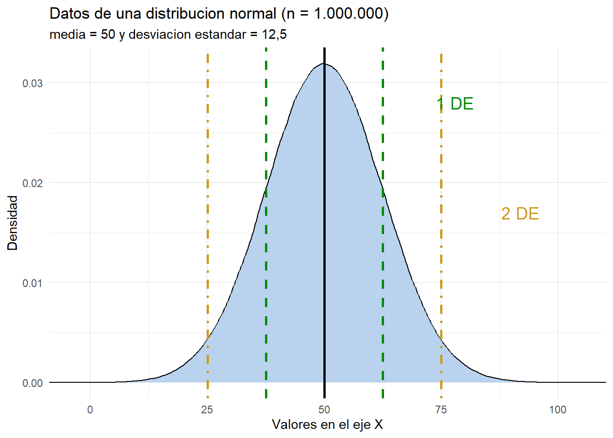

# La curva normal y los puntajes z

Este capitulo es un puente entre la estadistica descriptiva y la inferencia. Antes
de comparar grupos o estimar modelos necesitamos entender la **distribucion
normal**, porque casi todas las pruebas que usaremos (la prueba z, la prueba t, la
razon F) suponen que las medias muestrales se comportan de manera aproximadamente
normal. El capitulo sigue de cerca el material del curso CP-2007 de la Escuela de
Ciencias Politicas de la UCR ([@gomez2025]) y los conceptos de [@levin1999].

## La curva normal

La **curva normal** es un tipo de curva uniforme y simetrica cuya forma recuerda
a una campana, por lo que tambien se le llama "curva en forma de campana". Sus
rasgos mas importantes son:

- Es **simetrica**: si doblaramos la curva por su punto mas alto, las dos mitades
  serian identicas.
- Es **unimodal**: tiene un solo pico, y en ese punto coinciden la media, la
  mediana y la moda.
- Sus **colas** caen gradualmente y se extienden indefinidamente, acercandose a la
  linea de base sin alcanzarla nunca.
- El **area bajo la curva** (AUC, por sus siglas en ingles) entre la curva y la
  linea de base contiene el 100 % de los casos.

La simetria tiene una consecuencia muy util: cualquier distancia $\sigma$
(desviacion estandar) por encima de la media contiene la misma proporcion de casos
que la misma distancia por debajo. En concreto, en cualquier distribucion normal:

- aproximadamente el **68,26 %** de los casos cae entre $-1\sigma$ y $+1\sigma$;
- aproximadamente el **95,44 %** cae entre $-2\sigma$ y $+2\sigma$; y
- aproximadamente el **99,74 %** cae entre $-3\sigma$ y $+3\sigma$.

Esta es la llamada **regla 68-95-99,7**. Seis desviaciones estandar (tres hacia
cada lado) incluyen practicamente todos los casos de una distribucion normal.

## Generar datos normales en R

Para ver como funciona la curva normal, generemos datos aleatorios con la funcion
`rnorm()`. Le pedimos a R 50 observaciones de una distribucion normal con media
50 y desviacion estandar 12,5. Fijamos `set.seed()` para que el ejercicio sea
reproducible.


``` r
# Fijamos la semilla para que los resultados sean reproducibles
set.seed(2020)

# 50 observaciones de una normal con media 50 y desviacion estandar 12,5
datos1 <- rnorm(50, mean = 50, sd = 12.5)
sort(round(datos1, 1))
 [1] 12.0 15.0 21.4 35.2 35.9 36.3 39.3 39.8 40.7 40.9 43.0 43.7 45.4
[14] 45.4 46.2 46.4 47.1 48.2 48.5 49.1 50.3 50.7 51.0 51.4 51.5 52.5
[27] 53.2 53.6 53.8 54.0 54.7 54.9 55.6 56.1 58.3 59.0 60.4 61.4 61.4
[40] 61.7 61.7 63.7 63.7 65.0 66.2 71.3 72.0 72.5 77.2 80.4
```


``` r
# Parametros de la muestra generada
prom <- mean(datos1)
de <- sd(datos1)
c(Promedio = prom, Desviacion_estandar = de)
           Promedio Desviacion_estandar 
           51.57028            13.89987 

# Cuantos datos hay entre el promedio y una desviacion estandar (una cola)?
datos_df <- data.frame(x = datos1)
de1_df <- datos_df %>% filter(x >= prom & x <= (prom + de))
c(n = nrow(de1_df), porcentaje = round(100 * nrow(de1_df) / length(datos1), 1))
         n porcentaje 
        19         38 
```

Los parametros de la muestra (promedio y desviacion estandar) no coinciden
exactamente con los de la distribucion de la que salieron (50 y 12,5). Esto es
esperable: son numeros generados al azar. La **ley de los grandes numeros** dice
que cuanto mas grande sea la muestra, mas se acercaran los estadisticos muestrales
a los parametros verdaderos. Comprobemoslo generando un millon de datos.


``` r
set.seed(2020)
datos2 <- rnorm(1000000, mean = 50, sd = 12.5)

# Parametros de la muestra grande
c(Promedio = mean(datos2), Desviacion_estandar = sd(datos2))
           Promedio Desviacion_estandar 
           50.00676            12.49015 

# Cuantos datos hay entre el promedio y una desviacion estandar?
de1_df2 <- data.frame(x = datos2) %>% filter(x >= mean(datos2) & x <= (mean(datos2) + sd(datos2)))
c(porcentaje = round(100 * nrow(de1_df2) / length(datos2), 1))
porcentaje 
      34.1 
```

Con un millon de observaciones, el promedio y la desviacion estandar se acercan
muchisimo a 50 y 12,5, y el porcentaje de casos entre el promedio y una desviacion
estandar se acerca al 34,13 % teorico. La siguiente figura compara la densidad de
la muestra grande con las lineas de una y dos desviaciones estandar.

**Figura \@ref(fig:norm-density) Densidad de una distribucion normal simulada (n = 1.000.000)**

<div class="figure" style="text-align: center">

<p class="caption">(\#fig:norm-density)Densidad de una distribucion normal simulada con media 50 y desviacion estandar 12,5</p>
</div>

## Puntajes crudos y puntajes z (z-score)

En una distribucion normal podemos convertir cualquier **puntaje crudo** (un valor
$x$ de la escala original) en un **puntaje z** o **puntaje estandar**. El puntaje
z indica la direccion y el grado en que un puntaje crudo se desvia de la media,
medido en unidades de desviacion estandar. La formula es:

$$z=\frac{x-\bar{X}}{\sigma}$$

donde $x$ es el valor de interes, $\bar{X}$ es la media y $\sigma$ es la
desviacion estandar. La cantidad $x-\bar{X}$ se conoce como el **puntaje de
desviacion**, de modo que la formula tambien se escribe $z=x/\sigma$.

### Ejemplo resuelto

Supongamos que el ingreso anual en una ciudad se distribuye normalmente con media
de 5.000 dolares y desviacion estandar de 1.500. ¿Cual es el puntaje z de una
persona que gana 7.000?

$$z=\frac{7000-5000}{1500}=1,33$$

Un ingreso de 7.000 esta a 1,33 desviaciones estandar por encima del ingreso
medio. Veamos el mismo calculo con nuestros datos simulados, para el valor
$x=60$.


``` r
# Puntaje z de x = 60 en la distribucion simulada
x <- 60
z_score <- (x - mean(datos2)) / sd(datos2)
c(x = x, media = mean(datos2), sd = sd(datos2), z = z_score)
         x      media         sd          z 
60.0000000 50.0067584 12.4901492  0.8000899 
```

El puntaje crudo 60 representa 0,80 desviaciones estandar por encima del promedio.
Podemos comprobarlo en sentido inverso: si conocemos la desviacion estandar y el
puntaje z, recuperamos el puntaje crudo con $x = (z \cdot \sigma) + \bar{X}$.


``` r
# Fraccion de desviacion estandar a la que refiere el z-score
fraccion_sd <- sd(datos2) * z_score
# Promedio mas esa fraccion = puntaje crudo original
c(fraccion_sd = fraccion_sd, puntaje_crudo = mean(datos2) + fraccion_sd)
  fraccion_sd puntaje_crudo 
     9.993242     60.000000 
```

## El area bajo la curva y la funcion `pnorm()`

El area bajo la curva normal acumulada hasta un valor dado es una probabilidad.
En R la calculamos con la funcion `pnorm()`, que recibe el puntaje crudo, la media
y la desviacion estandar. Con `lower.tail = TRUE` obtenemos el area acumulada
**hasta** el valor; con `lower.tail = FALSE`, el area **posterior** a el.


``` r
# Area acumulada hasta x = 60 (AUC previa)
pnorm(q = 60, mean = mean(datos2), sd = sd(datos2), lower.tail = TRUE)
[1] 0.7881706

# Area entre el promedio y x = 60 (restando el 50 % que queda a la izquierda)
pnorm(60, mean = mean(datos2), sd = sd(datos2)) - 0.5
[1] 0.2881706

# Area posterior a x = 60
pnorm(60, mean = mean(datos2), sd = sd(datos2), lower.tail = FALSE)
[1] 0.2118294
```

Interpretacion de los tres resultados:

- El **78,8 %** de los casos esta por debajo de 60.
- El **28,8 %** esta entre el promedio (50) y 60.
- El **21,2 %** esta por encima de 60. Nota que 28,8 % + 21,2 % = 50 %, es decir,
  la mitad derecha de la distribucion.

### De la curva normal al valor p

El resultado mas importante para la inferencia es el que relaciona una distancia
de **1,96 desviaciones estandar** con el 95 %. Calculemoslo directamente.


``` r
# Probabilidad dentro de +/- 1,96 DE (dos colas)
P_dentro <- (pnorm(1.96, lower.tail = TRUE) - 0.5) * 2
P_dentro
[1] 0.9500042

# Probabilidad fuera de +/- 1,96 DE = valor p
1 - P_dentro
[1] 0.04999579
```

El **95 %** de los casos de una distribucion normal cae dentro de 1,96
desviaciones estandar de la media, y el **5 %** queda en las colas. Ese 5 % es el
origen del umbral $p < 0,05$ que usaremos en todos los capitulos de inferencia: un
resultado cae en las colas (es "extremo") cuando su puntaje z es mayor que 1,96 o
menor que -1,96. Este es el mismo 1,96 que aparece en la formula del margen de
error de la prueba t.

## Aplicacion con la encuesta del CIEP

Apliquemos lo aprendido a una variable real: la **edad** en la encuesta del CIEP
de noviembre de 2020. En el capitulo 5 vimos que la edad promedio de la muestra es
40,5 anos con una desviacion estandar de 15,3. ¿Que puntaje z corresponde a una
persona de 60 anos? ¿Que proporcion del electorado tiene 60 anos o menos?


``` r
edad_media <- mean(ciep$edad, na.rm = TRUE)
edad_sd <- sd(ciep$edad, na.rm = TRUE)

# Puntaje z de una persona de 60 anos
z_60 <- (60 - edad_media) / edad_sd
z_60
[1] 1.275269

# Proporcion del electorado con 60 anos o menos
pnorm(60, mean = edad_media, sd = edad_sd, lower.tail = TRUE)
[1] 0.8988929
```

Una persona de 60 anos esta a 1,28 desviaciones estandar por encima de la media, y
cerca del **90 %** del electorado tiene 60 anos o menos. Este tipo de calculo es
la base de la estandarizacion: comparar observaciones de distribuciones distintas
llevandolas a una escala comun de puntajes z.

> **Punto clave.** El puntaje z es una medida relativa: no dice si un valor es
> alto o bajo en abstracto, sino cuantas desviaciones estandar se aleja de la
> media de su propia distribucion. Por eso permite comparar variables medidas en
> escalas distintas.

## Resumen

- La curva normal es simetrica, unimodal y su area total es 1.
- La regla 68-95-99,7 describe la proporcion de casos en torno a la media.
- El puntaje z estandariza cualquier valor: $z=(x-\bar{X})/\sigma$.
- `pnorm()` traduce puntajes crudos (o z) en areas bajo la curva, es decir, en
  probabilidades.
- La distancia de 1,96 desviaciones estandar delimita el 95 % central y es la
  base del valor p que usaremos en las pruebas de hipotesis.
