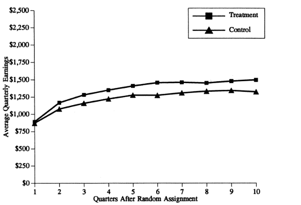
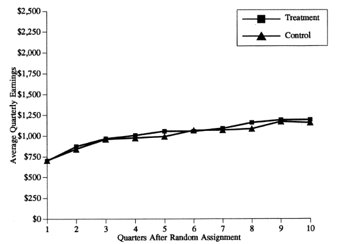
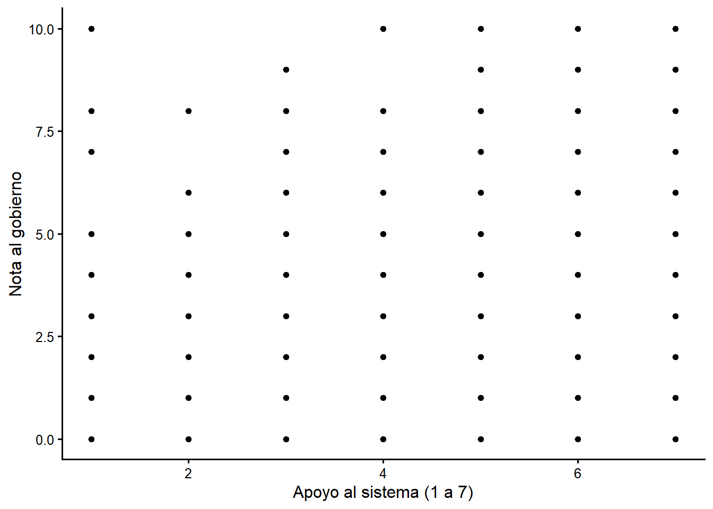
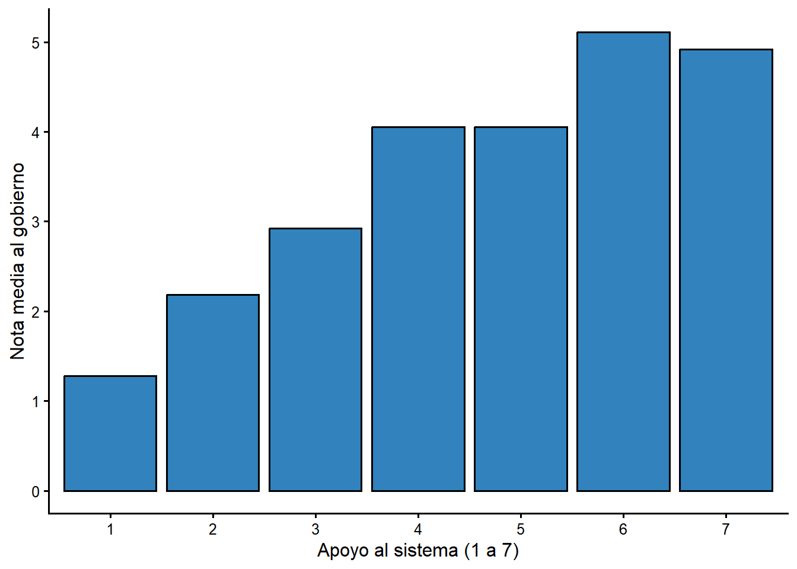
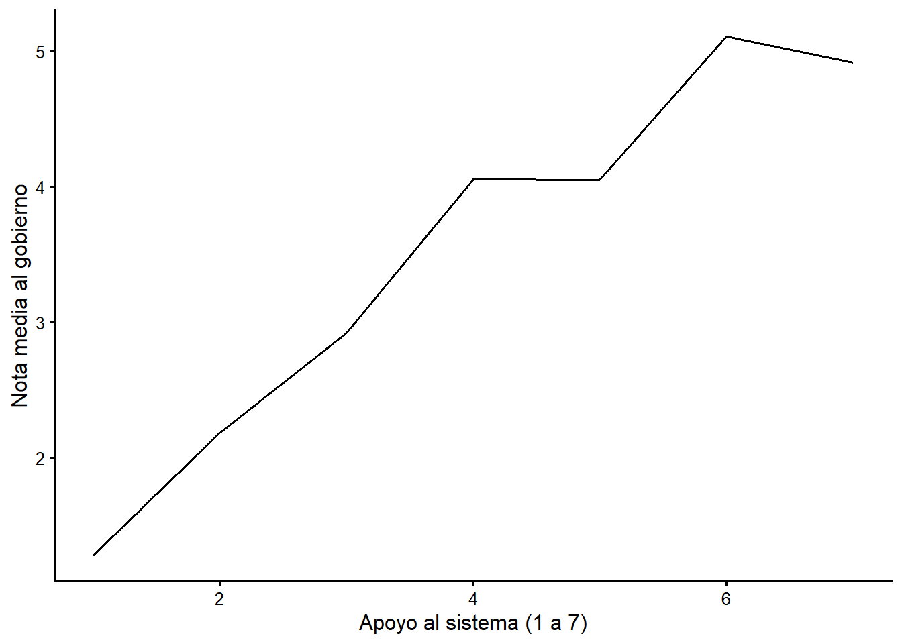
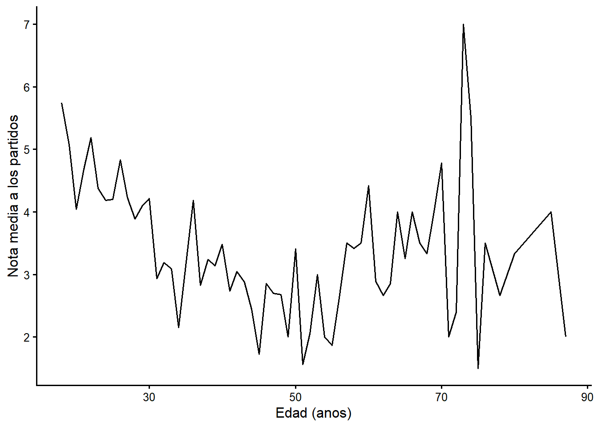
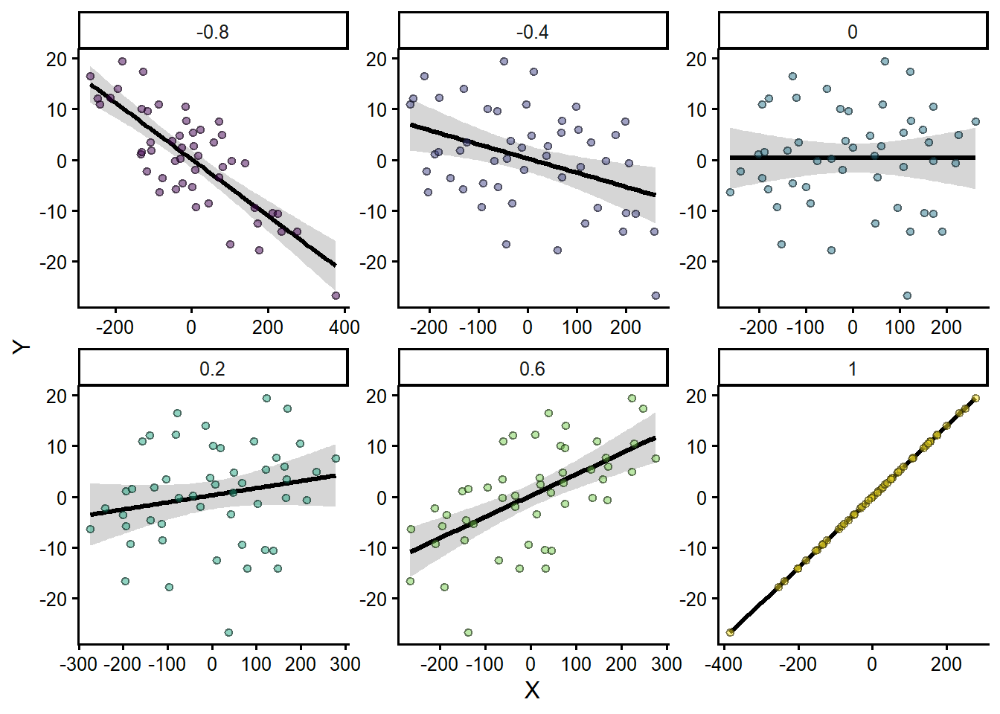

# Introduccion a las medidas de asociacion: la correlacion

Muchas preguntas de investigacion en disciplinas muy distintas se centran en una
pregunta simple: si comparas a los miembros de dos grupos, ¿como difiere la media
de alguna variable de interes? En medicina, ¿en que difiere el grupo tratado del
grupo de control? ¿Cual es el *efecto promedio del tratamiento*? En politicas
publicas, ¿que ocurre con las personas que participan en un programa de gobierno
frente a quienes no participan? En la investigacion social, ¿que ocurre cuando
estas expuesto a mas noticias o a un entorno social mas diverso?

Hay dos enfoques principales para atacar este tipo de pregunta: **observar** o
**experimentar**. Los experimentos son muy superiores a la observacion, y usamos
evidencia experimental particularmente rigurosa, por ejemplo, en el proceso de
aprobacion de medicamentos. La investigacion medica suele basarse en ensayos
aleatorizados doble ciego: un experimento en el que a las personas se les asigna
al azar un tratamiento o un placebo, y ni quien investiga ni quien participa sabe
quien recibe cual. Lo unico que difiere entre el grupo de control y el grupo
tratado es la exposicion al tratamiento; los grupos no varian en nada mas. Esta
estrategia aisla el efecto del tratamiento de cualquier otra variable.

La segunda mejor alternativa (y la estrategia de este curso) es la
**observacion**. Observamos a personas agrupadas por alguna caracteristica (no
asignada al azar) e intentamos usar la estadistica para aislar el efecto de esa
caracteristica. En tu primera tarea quizas comparaste el apoyo al sistema de
personas jovenes y mayores. Pero en Costa Rica la demografia y la geografia de un
grupo de personas mayores probablemente difieren bastante de las de un grupo de
personas jovenes. Las personas mayores tienen, en promedio, un nivel educativo
menor y viven mas en ciertas provincias. Asi que una estrategia observacional no
nos permite aislar con precision el efecto solo de la edad.

Despues de repasar algunas caracteristicas clave de los disenos experimentales,
pasaremos a las formas en que usamos la estadistica para implementar una
estrategia observacional.

## Investigacion experimental en ciencias sociales y politicas publicas

Las ciencias sociales (economia, sociologia, ciencia politica) historicamente se
han basado mas en la observacion que en experimentos. Pero hay al menos dos tipos
de disenos experimentales bastante comunes. Las politicas publicas pueden
evaluarse asignando al azar a las personas a recibir o no un servicio o programa.
Y la investigacion por encuesta puede entregar al azar un conjunto de preguntas a
un grupo y otro conjunto a otro grupo.

Un conjunto interesante de trabajos pide a las personas evaluar la idoneidad de un
candidato tras leer una semblanza biografica y ver una fotografia. A un grupo
(seleccionado al azar) se le muestra la foto de un candidato blanco; al segundo
grupo se le muestra la foto de un candidato de una minoria. La *manipulacion* (lo
que cambia al repetir la encuesta) es simplemente la foto. Por ejemplo,
[@terkildsen1997] encuesto a miembros blancos de jurados en Kentucky en 1991-92 y
encontro que los candidatos blancos se ven mas favorablemente que los candidatos
de minorias: esto es obviamente preocupante, ¡es un jurado!

Los costos y la complejidad de este tipo de experimento son importantes: hay que
administrar dos encuestas distintas a dos grupos tomados completamente al azar de
algun conjunto. El diseno experimental tambien exige mucha atencion al texto y a
las condiciones de la encuesta. Ademas, los experimentos sociales plantean
preguntas eticas: nos incomoda la idea de que alguien manipule el voto o las
actitudes en un experimento.

Los experimentos de politicas publicas plantean retos similares. Para contrastar
el efecto de un programa, algunas personas deben recibirlo y otras deben quedar
excluidas. ¿Podemos deshacer el impacto de negarle el acceso a un programa que
funciona? Los costos administrativos tambien pesan. Pero los beneficios de los
enfoques experimentales pueden ser grandes: si tuvieramos buenos datos sobre que
programas funcionan y con que efecto, podriamos tomar mejores decisiones sobre la
asignacion de recursos. Esta idea esta detras de la coleccion de ensayos
*Moneyball for Government* [@nussle]. Cualquier programa con alta demanda y pocos
servicios disponibles es candidato para un experimento.

### Un ejemplo: los programas de la Job Training and Partnership Act (JTPA)

Un ejemplo temprano y convincente de este tipo de investigacion fue una
evaluacion de los programas de la *Job Training and Partnership Act* (JTPA) a
finales de los anos ochenta. Los programas ofrecian capacitacion en aula,
entrenamiento en el trabajo o ayuda para buscar empleo a personas desempleadas.
En septiembre de 1987, dos tercios de la poblacion elegible que aplico al
programa fue dirigida a servicios y un tercio fue postergada 18 meses. ¿La
capacitacion y los servicios ofrecidos a personas desempleadas aumentan sus
ingresos? Los resultados se resumen en las dos figuras siguientes.

**Figura 3.1. Efectos estimados de los programas JTPA sobre los ingresos**

**Mujeres de 21 anos o mas**



**Mujeres de 18 a 20 anos**



Reproducido de [@bloom1997]. "The Benefits and Costs of JTPA Title II-A
Programs...".

Los resultados son notables. Los beneficios del programa para las mujeres adultas
fueron grandes: tuvieron diferencias positivas y persistentes en sus ingresos. El
programa funciono. Pero los beneficios no se observaron en las mujeres mas
jovenes: esos servicios no funcionaron. Una respuesta sensata seria disenar
servicios distintos para las mujeres jovenes y matricular a tantas mujeres
adultas como fuera posible.

## Enfoques observacionales: ¿que opciones tenemos?

¿Como comparamos dos grupos si no podemos hacer un experimento? En la primera
tarea comparaste el apoyo de dos grupos. Tu estrategia fue comparar unas pocas
estadisticas descriptivas clave y reportar unos pocos porcentajes que resumieran
las diferencias. Usaste una distribucion de frecuencias para producir los
porcentajes: esto se conoce como tabla de "una via". Tambien podemos usar figuras
y tablas de dos vias para resumir el mismo tipo de informacion.

### Tablas

Si quieres comparar los valores de alguna variable de interes (el voto por el PAC)
entre los niveles de otra variable (educacion, provincia, sexo), podemos producir
una tabla con los mismos tipos de porcentajes que vimos en la tabla de
frecuencias. Esto se conoce como **tabulacion cruzada**, y la tabla de dos
variables se conoce como **tabla de contingencia** o *cross-tab*. Por ahora
ignoraremos el problema de que agrupar por una variable predictora no crea grupos
aleatorios; volveremos a eso mas adelante.

#### Ejemplo: voto por el PAC y provincia

¿Como esperarias que cambie el voto por el PAC segun la provincia? La encuesta del
CIEP clasifica la provincia en dos categorias: provincia costera y provincia
central. Una forma empirica de responder la pregunta es construir una tabla de
contingencia entre provincia y voto por el PAC.

**Tabla \@ref(tab:table31) Voto por el PAC y provincia, encuesta CIEP 2020**


``` r
tabla31 <- round(100 * prop.table(table(ciep$votopac_f, ciep$prov_f), margin = 2), 1)
kable(tabla31, digits = 1,
      caption = "Porcentajes por columna. Fuente: CIEP-UCR, noviembre 2020.")
```


Table: (\#tab:table31)Porcentajes por columna. Fuente: CIEP-UCR, noviembre 2020.

|            | Provincia costera| Provincia central|
|:-----------|-----------------:|-----------------:|
|No voto PAC |              68.8|                48|
|Voto PAC    |              31.2|                52|


¿Es esto consistente con tus expectativas? Es claro que la probabilidad de votar
por el PAC es mucho mayor en la provincia central (52,0 %) que en las provincias
costeras (31,2 %). La diferencia regional es considerable. En los capitulos
siguientes veremos si esa diferencia sobrevive cuando controlamos por otras
caracteristicas, como el nivel educativo.

### Figuras

En muchos casos es mas util producir una figura que una tabla.

¿Que pasa si la tabla implicaria un numero muy grande de celdas? En el ejemplo
anterior, 2 categorias de voto por 2 provincias implican 4 celdas: un numero
manejable. Pero si usaramos una variable con muchos niveles, la tabla se volveria
inmanejable. Veamos un ejemplo con una variable continua.

#### Ejemplo: la evaluacion del gobierno y el apoyo al sistema

Antes de volver a los datos de voto, consideremos un ejemplo que introduce las
escalas de evaluacion de la encuesta del CIEP. La encuesta pide a las personas
poner una **nota de 0 a 10** a varias instituciones: la Asamblea Legislativa, la
Defensoria de los Habitantes, el gobierno, el Organismo de Investigacion Judicial,
los partidos politicos, el Poder Judicial, la Sala Constitucional, la Universidad
de Costa Rica y las otras universidades publicas. Una nota de 0 significa "muy
mal" y una de 10, "muy bien".

¿Como se relacionan las actitudes hacia el gobierno con el apoyo al sistema
politico (`b6`, de 1 a 7)? ¿Que tan diferentes son las personas que apoyan poco
al sistema de las que lo apoyan mucho?

Hay tres estrategias de visualizacion para resumir el vinculo entre estas
variables: un diagrama de dispersion, un grafico de barras de medias de grupo o un
grafico de lineas de medias de grupo. En cada figura, el eje vertical representa
lo que tratamos de explicar (la **variable dependiente**, Y) y el eje horizontal
representa el predictor (la **variable independiente**, X).

**Figura \@ref(fig:figure2) Diagrama de dispersion. Nota al gobierno y apoyo al sistema**

<div class="figure">

<p class="caption">(\#fig:figure2)Diagrama de dispersion: nota al gobierno y apoyo al sistema</p>
</div>

La primera figura (el diagrama de dispersion) no es muy util: con cientos de
personas y pocos valores posibles, terminamos con una rejilla de puntos. Esto
ocurre con cualquier encuesta que tenga un numero finito y pequeno de respuestas
posibles y muchas personas participantes.

Las figuras segunda y tercera, mas abajo, lo dejan mucho mas claro. Hay un
aumento marcado en la nota al gobierno a medida que aumenta el apoyo al sistema.

**Figura \@ref(fig:figure3) Grafico de barras de medias de grupo. Nota al gobierno y apoyo al sistema**

<div class="figure">

<p class="caption">(\#fig:figure3)Grafico de barras: media de la nota al gobierno por nivel de apoyo al sistema</p>
</div>

**Figura \@ref(fig:figure4) Grafico de lineas. Nota al gobierno y apoyo al sistema**

<div class="figure">

<p class="caption">(\#fig:figure4)Grafico de lineas: media de la nota al gobierno por nivel de apoyo al sistema</p>
</div>

### La edad y la evaluacion de los partidos, revisitada

Usamos una tabla para describir el vinculo entre el voto y la provincia. Tambien
podemos usar una variable mas fina, como la edad. La Figura \@ref(fig:figure5), un
grafico de lineas de la nota media a los partidos politicos segun la edad, sugiere
que hay una relacion negativa pero muy debil ("ruidosa") entre la edad y la
evaluacion de los partidos: las personas mayores tienden a calificar un poco peor
a los partidos.

**Figura \@ref(fig:figure5) Edad y evaluacion de los partidos politicos**

<div class="figure">

<p class="caption">(\#fig:figure5)Edad y nota media a los partidos politicos</p>
</div>

La relacion es "ruidosa": la linea no sube ni baja de forma ordenada en todos los
valores de edad. La correlacion entre la edad y la nota a los partidos es apenas
-0,22, lo que confirma que el vinculo es debil.

## ¿Por que usar estadistica si podemos resumir con figuras?

¿Por que usar estadistica? La respuesta simple: porque usamos una muestra
pequena.

¿Como sabemos si la relacion observada en la muestra (mas apoyo al gobierno a
medida que aumenta el apoyo al sistema) tambien se observa en la poblacion mas
amplia? Usamos estadistica, en concreto un grupo de estadisticos de prueba
conocidos como **medidas de asociacion**, para hacer una **inferencia** sobre la
relacion en la poblacion. Una de estas medidas, la correlacion, se introduce
brevemente abajo; las otras dos se desarrollan en los capitulos 4 y 5.

La inferencia es aprender sobre algo que no podemos observar a partir de algo que
si podemos observar. Podemos observar muestras pequenas; a menudo no podemos
observar ni medir poblaciones completas, porque es demasiado caro y poco practico.

La clave de esta forma de inferencia es que las muestras deben ser **aleatorias**.
Cualquier persona de la poblacion debe tener la misma probabilidad de aparecer en
la muestra. Hoy es mas dificil alcanzar al electorado por telefono, y las
encuestas presenciales como la del CIEP enfrentan el **sesgo de no respuesta**:
las personas dispuestas a participar en una encuesta pueden ser distintas de
quienes no participan. Eso podria alejar a la muestra de ser un corte
verdaderamente aleatorio de la poblacion.

## ¿Que son las medidas de asociacion?

Si tenemos una muestra aleatoria de una poblacion mas amplia, podemos usar
medidas de asociacion para describir relaciones entre variables. En el lexico de
la ciencia de datos, la variable que nos interesa se conoce como **variable
dependiente** ($Y$) y la variable predictora como **variable independiente**
($X$). Suponemos que $X$ influye en $Y$, o que $Y$ es funcion de $X$.

Usamos medidas de asociacion para responder tres preguntas: ¿cual es la
**direccion** de la relacion?, ¿cual es el **tamano** del efecto? y ¿es el efecto
en la muestra **estadisticamente significativo**?

- **Direccion.** ¿Un aumento en $X$ aumenta (+) o disminuye (-) $Y$?
- **Tamano.** ¿$X$ tiene un impacto grande o pequeno sobre $Y$?
- **Significancia estadistica.** ¿El efecto observado podria deberse al azar?

Nos centraremos en el tamano y la direccion al aprender la correlacion, y pasaremos
al concepto de significancia estadistica en el capitulo 5.

Recordemos los tipos de variables. Distinguimos entre variables **categoricas**
(las personas se agrupan en categorias que no se pueden ordenar: provincia,
religion, estado civil), **ordinales** (categorias que se pueden ordenar: apoyo
al sistema, ideologia) y **de intervalo** (categorias ordenadas en una escala con
intervalos iguales: edad, anos de educacion).

Para este curso vemos tres medidas de asociacion: **chi-cuadrado**,
**correlacion** y **prueba t**. La eleccion depende de los tipos de variables:

- Si $X$ y $Y$ son ambas de intervalo u ordinales, corresponde usar **correlacion**.
- Si $X$ y $Y$ son ambas categoricas, solo corresponde usar **chi-cuadrado**.
- Si $Y$ es de intervalo u ordinal y $X$ es categorica con solo dos categorias,
  usamos la **prueba t**.

La logica detras de cada medida es la misma: ¿es la media de una variable ($Y$)
distinta en distintos valores de $X$? Primero formulamos una teoria sobre lo que
esperamos y luego la contrastamos con los datos.

## Correlacion

En muchas situaciones de investigacion las variables de interes son ambas algun
tipo de escala, ya sea de intervalo u ordinal. Esto incluye medidas concretas como
el ingreso, los anos de educacion o la edad, y conceptos que ordenamos de forma
significativa, como la ideologia o una escala de apoyo (de 1 a 7). Si te interesa
determinar la relacion entre dos variables que son escalas, debes calcular y usar
el **coeficiente de correlacion**.

### ¿Que es la correlacion?

La correlacion es una medida de asociacion apropiada para variables de nivel de
intervalo (y puede aplicarse a variables ordinales que son "aproximadamente de
intervalo", por ejemplo el apoyo al sistema o la ideologia). El estadistico va de
-1 a +1 y ofrece un resumen en un solo numero de la direccion y el tamano de la
relacion entre $X$ y $Y$.

Si dos variables tienen una correlacion de +1 o -1, estan perfectamente
correlacionadas. Si la correlacion es mayor que 0, las variables se describen como
**positivamente relacionadas**. Si es menor que 0, se describen como
**negativamente relacionadas**. A medida que la correlacion se aleja de cero (mas
cerca de +1 o -1), mas fuerte es el vinculo. Una correlacion de cero es una
relacion nula. Negativo no significa nulo: nulo es cero.

**Figura \@ref(fig:example) Efectos positivos, negativos y nulos**

<div class="figure">

<p class="caption">(\#fig:example)Ejemplos de correlacion positiva, negativa y nula</p>
</div>

Puedes describir tus expectativas con estos numeros. Por ejemplo, esperarias que,
a mayor nivel educativo, mayor fuera la valoracion de las universidades publicas.
Esperarias una correlacion positiva entre la educacion y la nota a la universidad.

### Calculo

El calculo del coeficiente de correlacion requiere la covarianza de dos variables
y la desviacion estandar de cada una.

Recuerda que la desviacion estandar $\sigma$ es simplemente la raiz cuadrada de la
varianza muestral:

$$ \sigma_x = \sqrt{\frac{\sum_{i=1}^n (X_i - \mu)^2}{n-1}}$$

Comparamos cada valor individual de $X$ con la media del grupo. Si muchas personas
estan por encima o por debajo de la media, la varianza y la desviacion estandar
son altas. Si muchas estan cerca de la media, son bajas.

El componente basico de la correlacion es la **covarianza**, que sigue la misma
logica que la varianza. Comparamos cada valor de $X$ con la media de $X$ y lo
multiplicamos por el valor de $Y$ de esa misma persona menos la media de $Y$. Si
las personas con valores altos de una variable tambien tienen valores altos de la
otra, la covarianza es positiva.

En simbolos, la covarianza es:

$$ cov(X,Y)= \frac{\sum_{i=1}^n (X_i - \mu_x)(Y_i - \mu_y)}{n-1} $$

Una vez conocida la covarianza y la desviacion estandar de cada variable, podemos
calcular la correlacion. El coeficiente de correlacion muestral ($\rho$) es la
covarianza entre $X$ y $Y$ dividida entre la desviacion estandar de $X$ y la de
$Y$. En simbolos:

$$ \rho=\frac{cov(X,Y)} {\sigma_x\sigma_y} $$

Este numero nunca puede ser mayor que 1,0 ni menor que -1,0. Cuanto mas lejos de
cero, mayor el efecto de $X$ sobre $Y$.

### Tres limites importantes del coeficiente de correlacion

#### La correlacion es mas util como medida relativa

Primero, la correlacion se usa mejor como descripcion de la direccion y el tamano
relativo de la relacion (una correlacion de 0,8 es mas fuerte que una de 0,5). Es
menos util como medida absoluta: una correlacion de 0,5, sin conocer el tipo de
datos, las variables u otras correlaciones de la muestra, no dice mucho por si
sola.

#### La correlacion supone una relacion lineal

Segundo, las afirmaciones sobre correlacion suponen que la relacion entre dos
variables es **lineal** (o aproximadamente lineal). Las relaciones no lineales
pueden no reflejarse en la correlacion.

Por ejemplo, no podriamos capturar bien el vinculo entre el apoyo al sistema y la
nota al gobierno si la relacion tuviera forma de U. Cuando la relacion es de ese
tipo, la correlacion puede subestimar el vinculo real.

#### La correlacion no sirve para categorias arbitrarias

Finalmente, nunca uses la correlacion si las variables no son escalas. Tenemos
variables que son simplemente categorias: provincia, estado civil, ocupacion.
Usamos un numero para ubicar a las personas en categorias, pero el numero es
arbitrario. Por ejemplo, si codificamos provincia costera = 0 y central = 1, la
"distancia" entre esas categorias no tiene sentido. Cada vez que el orden de las
categorias es arbitrario, no debes usar correlacion, porque seria enganosa.

### Leer una matriz de correlacion

La mayoria de los programas estadisticos producen las correlaciones en forma de
**matriz**. La Tabla 3.2 reproduce la salida que resume el vinculo
entre la nota al gobierno y la nota a los partidos politicos. Por ahora solo
necesitamos fijarnos en un numero, la correlacion de Pearson.

**Tabla 3.2 Correlacion entre la nota al gobierno y la nota a los partidos**


```
         nota_gob nota_pp
nota_gob    1.000   0.522
nota_pp     0.522   1.000
```

La correlacion entre la nota al gobierno y la nota a los partidos es 0,522.
Podemos aprender dos cosas. Primero, el vinculo es positivo: quienes mejor
califican al gobierno tambien tienden a calificar mejor a los partidos. Segundo,
el vinculo no es perfecto: hay personas que califican bien a uno y mal al otro.

Nota que la forma mas util de usar la correlacion es **comparar** las correlaciones
entre dos pares de variables del mismo conjunto de datos. La Tabla
3.3 trata la nota al gobierno como variable dependiente $Y$ y
contrasta el vinculo con varios predictores.

**Tabla 3.3 Matriz de correlacion: apoyo al sistema, notas a instituciones, educacion y edad**


```
                 Apoyo al sistema Nota al gobierno Nota a partidos
Apoyo al sistema            1.000            0.408           0.308
Nota al gobierno            0.408            1.000           0.529
Nota a partidos             0.308            0.529           1.000
Nota a la UCR               0.176            0.214           0.196
Educacion                   0.041            0.100           0.031
Edad                        0.082           -0.056          -0.217
                 Nota a la UCR Educacion   Edad
Apoyo al sistema         0.176     0.041  0.082
Nota al gobierno         0.214     0.100 -0.056
Nota a partidos          0.196     0.031 -0.217
Nota a la UCR            1.000    -0.044 -0.100
Educacion               -0.044     1.000 -0.120
Edad                    -0.100    -0.120  1.000
```

Esta salida es una matriz de correlacion: puedes ver todas las correlaciones en
una sola tabla. En esta muestra, la correlacion entre el apoyo al sistema y la
nota al gobierno es 0,408; la correlacion entre la nota al gobierno y la nota a
los partidos es 0,529. El apoyo al sistema es un buen predictor de la nota al
gobierno, pero la evaluacion de los partidos lo es aun mas. La correlacion entre
la educacion y las notas es cercana a cero (por ejemplo, educacion y nota a la
UCR = -0,044), lo que indica que el nivel educativo **no** predice la valoracion
de las instituciones. La edad tiene una correlacion negativa debil con la nota a
los partidos (-0,217): las personas mayores califican un poco peor a los
partidos.

## Conclusion

Mientras que las figuras y tablas son utiles para comunicar lo que vemos o
aprendemos de los datos, las medidas de asociacion nos dan dos formas de
aprovechar la informacion. Primero, podemos comparar mejor el tamano de dos
efectos con un numero que con una figura o tabla. Segundo, y este es el foco del
siguiente capitulo, podemos ser precisos sobre lo que podemos inferir de la
poblacion a partir de nuestra muestra. La correlacion es una forma especialmente
simple y util de resumir la direccion y el tamano relativo del vinculo entre
variables ordenadas de forma significativa.
