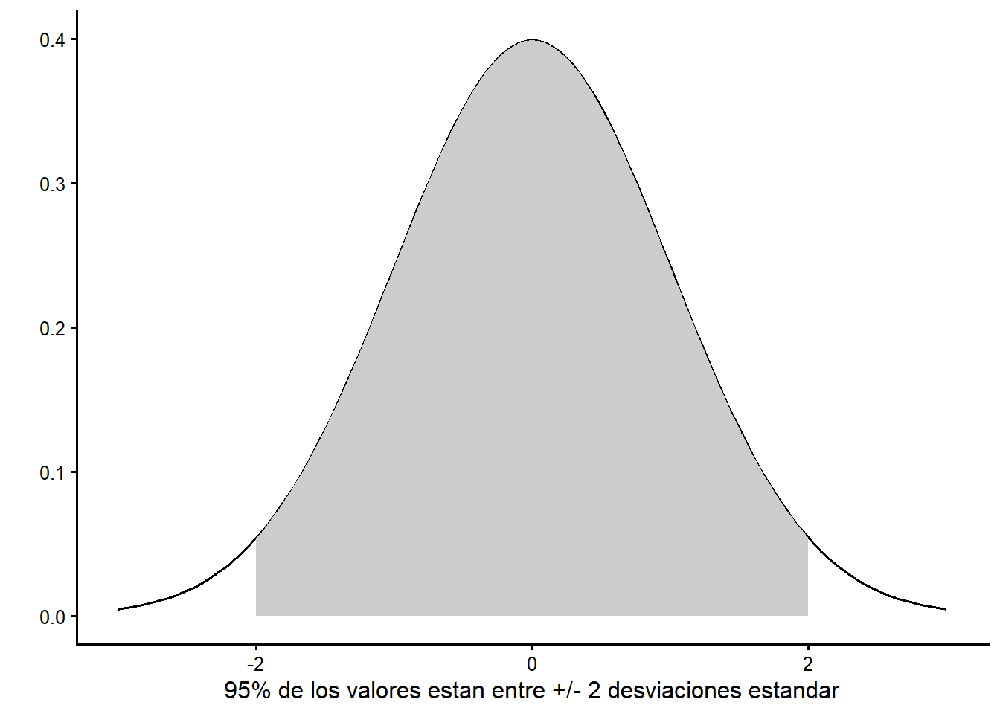
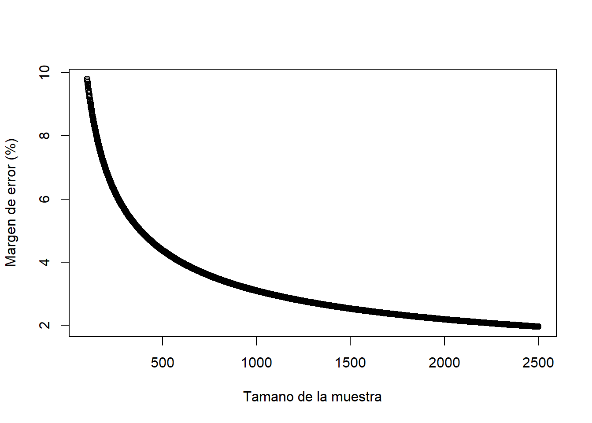
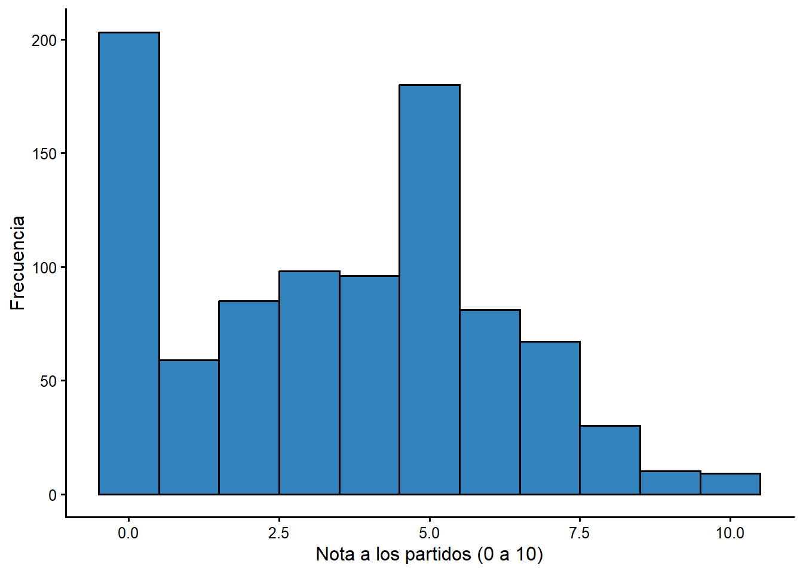

# Medidas de asociacion: la prueba t

## ¿Que es la prueba t?

En muchas situaciones de investigacion la variable $Y$ es algun tipo de escala, ya
sea de intervalo u ordinal. Esto incluye medidas concretas como el ingreso, los
anos de educacion o la edad, y conceptos que ordenamos de forma significativa,
como la ideologia, el apoyo al sistema (de 1 a 7) o una nota (de 0 a 10). Pero la
variable $X$ puede ser una categoria: provincia, estado civil, genero, situacion
laboral. Si te interesa determinar la relacion entre dos variables cuando $Y$ es
una escala y $X$ es una categoria, la **prueba t** es la medida de asociacion
apropiada.

Hemos usado estadisticos (media, mediana, desviacion estandar) para describir
variables individuales. Usaremos un estadistico de prueba simple (la prueba t)
para determinar si dos grupos de una muestra son diferentes. Las pruebas t son
mas apropiadas e informativas cuando comparas dos grupos (mujer/hombre, con
empleo/desempleado, provincia costera/central) en una escala continua.

Recuerda que usamos medidas de asociacion para describir relaciones entre
variables. Identificamos una variable dependiente ($Y$), una variable
independiente ($X$) y tenemos una teoria sobre como $X$ influye en $Y$. La medida
de asociacion nos ayuda a ser precisos sobre tres cosas:

- la **direccion** de la relacion (¿pasar de una categoria de $X$ a otra aumenta
  (+) o disminuye (-) $Y$?);
- el **tamano** del efecto (¿$X$ tiene un impacto grande o pequeno sobre $Y$?);
- si los efectos en la muestra son **estadisticamente significativos** (¿podria el
  efecto observado deberse al azar o al error de muestreo?).

Cubrimos tamano y direccion en el capitulo 3, asi que el foco de este capitulo es
ampliar tu comprension de la **significancia estadistica**. Para ello hablamos de
inferencia e introducimos el concepto de **distribucion muestral**. Al final del
capitulo deberias tener una idea de que significa significancia estadistica.

## ¿Que es la inferencia? ¿Y que tiene que ver con las muestras aleatorias?

La inferencia es aprender sobre algo que no podemos observar a partir de algo que
si podemos observar. Podemos observar muestras; no podemos observar y medir
poblaciones. La inferencia es aprender sobre poblaciones a partir de muestras.
Para hacer una inferencia insesgada sobre una poblacion a partir de una muestra
pequena, el unico requisito es que la muestra sea **aleatoria**: cualquier persona
de la poblacion debe tener la misma probabilidad de aparecer en la muestra.

Las organizaciones de encuestas dedican mucho tiempo y energia a crear muestras
aleatorias. Hoy pueden usar contactos presenciales, telefonicos o por internet;
cada estrategia tiene sus retos. Todas introducen el llamado **sesgo de no
respuesta**: las personas dispuestas a responder pueden ser distintas de quienes
no responden. Hay soluciones tecnicas, pero garantizar que una muestra sea
aleatoria sigue siendo un reto.

Aun con una muestra aleatoria, sabemos que habra incertidumbre sobre cuanto se
parece la muestra a la poblacion mas amplia: incluso si la muestra es
completamente aleatoria, nunca representara perfectamente a la poblacion. A esto
se le llama **error de muestreo**. Podriamos obtener una muestra que, por azar,
tenga muchas personas que votaron por cierto partido, lo que daria una estimacion
equivocada.

Usamos muestreo aleatorio porque queremos hacer inferencias sobre la poblacion a
partir de la muestra. Si las muestras son aleatorias, entonces los estadisticos
descriptivos tambien tienen **distribuciones muestrales** con propiedades
conocidas. Esta es una idea crucial que sustenta la forma en que usamos la
estadistica para mejorar lo que podemos afirmar que sabemos a partir de una
muestra. Exploramos la distribucion muestral de la media para que veas como
funciona.

## La distribucion muestral de la media

La media tiene una distribucion muestral. Considera un experimento: si tomaramos
1.000 muestras aleatorias (o cualquier numero realmente grande) de una poblacion,
resulta que las medias de esas 1.000 muestras se distribuyen de forma normal, con
algunas propiedades que entendemos.

- La media de las medias muestrales es igual a la media poblacional (la media
  muestral es una estimacion insesgada de la media poblacional).
- La desviacion estandar de la distribucion muestral es igual a la desviacion
  estandar de la variable en la poblacion (aproximada con la de la muestra)
  dividida entre la raiz cuadrada del tamano de la muestra:

$$ \sigma_{M} = \frac{\sigma}{\sqrt{n}} $$

A medida que el tamano de la muestra crece, el ancho de la distribucion muestral
disminuye. Con muestras muy pequenas, podrias obtener medias muy distintas de la
verdadera media poblacional.

Como conocemos la media y la desviacion estandar de esta distribucion normal,
podemos aprovechar lo que sabemos sobre la distribucion normal. La Figura
\@ref(fig:figure1) muestra una distribucion normal estandar (media 0 y desviacion
estandar 1). Sabemos que el 95 % del area bajo esta distribucion esta entre -2 y
+2 desviaciones estandar de la media.

**Figura \@ref(fig:figure1) La distribucion normal estandar**

<div class="figure">

<p class="caption">(\#fig:figure1)La distribucion normal estandar</p>
</div>

### Calcular el margen de error

Sabemos que el 95 % de los valores reportados de un gran numero de muestras
repetidas estaran dentro de aproximadamente 2,0 desviaciones estandar (tecnicamente
1,96) de la media poblacional. El margen de error asociado a cualquier muestra
aleatoria es:

$$ME = 2*\sigma_{M} = 2*\frac{\sigma}{\sqrt{n}}$$

Si tienes datos de una sola muestra aleatoria, puedes usar el software para
calcular la media y la desviacion estandar y, conociendo el tamano de la muestra,
reportar una estimacion de la media poblacional +/- el margen de error. La Tabla
4.1 reporta las estadisticas descriptivas de la edad en la encuesta
del CIEP. La persona encuestada promedio de la muestra tiene 40,5 anos. ¿Que nos
dice eso sobre la poblacion?

**Tabla 4.1 Estadisticas descriptivas de la edad, encuesta CIEP 2020**


|                    | Estadisticas descriptivas |
|:-------------------|:-------------------------:|
|N                   |            954            |
|Media               |           40.47           |
|Mediana             |            38             |
|Varianza            |          234.54           |
|Desviacion estandar |           15.31           |


Usando la formula anterior, el error estandar de la media seria:

$$ \sigma_M = 15,31 / \sqrt{954} = 0,50 $$
$$ ME = 2 * 0,50 = 0,99 $$

Sabemos (con 95 % de certeza) que la media poblacional esta a +/- 2 errores
estandar de la media de la muestra. El **intervalo de confianza del 95 %** es
40,47 +/- 0,99 anos, es decir, aproximadamente entre 39,5 y 41,5 anos. Esto es
notable: podemos estar bastante seguros de la edad promedio real de la poblacion
adulta de Costa Rica con un margen menor a un ano.

> La leccion clave: el "margen de error" asociado a la respuesta de la encuesta
> es 2 veces el error estandar de la media.

### Margen de error y tamano de la muestra

Para una pregunta con respuesta Si/No (1/0), la desviacion estandar no puede ser
mayor que aproximadamente 0,5 en muestras grandes. La desviacion estandar mas alta
seria un 50 % de "si" y un 50 % de "no", es decir, media 0,5.

Asi, para una muestra de 1.000 votantes, el error estandar de la media seria:

$$\sigma_M = 0,5 / \sqrt{n} = 0,50 / \sqrt{1000} = 0,016$$

Podriamos estar seguros de que la media poblacional estaria dentro de +/- 2 veces
el error estandar = 0,032, o 3,2 % de la media muestral del 50 %. Como ves en las
noticias, si preguntas a 1.000 personas si estan a favor o en contra de una
propuesta, el margen de error es de aproximadamente +/- 3 %.

Una implicacion: cada observacion nueva mejora las estimaciones, porque el error
estandar baja al crecer el tamano de la muestra (dividimos entre la raiz cuadrada
del numero de observaciones). La figura siguiente muestra esta mejora.

**Figura \@ref(fig:figure2) Margen de error si la desviacion estandar muestral es ~ 0,5, para muestras de 100 a 2500**

<div class="figure">

<p class="caption">(\#fig:figure2)Margen de error segun el tamano de la muestra</p>
</div>

Puedes ver que hay una mejora grande al pasar de 500 a 1.000 observaciones, pero
mucho menor al pasar de 1.000 a 1.500. En la practica podrias ver muestras mucho
mas grandes por dos razones. Primero, a veces necesitamos estimaciones muy
precisas (no querrias estimar el desempleo con +/- 2 %). Segundo, podrias estar
interesado en subconjuntos de la poblacion: para tener un buen margen de error
para un subgrupo, necesitas una muestra total muy grande.

## Prueba t: comparar las medias de dos grupos

Si tenemos la media muestral de una variable para algun grupo, podemos usar esa
informacion, junto con el numero de personas en cada grupo y la desviacion
estandar de cada grupo, para hacer una inferencia sobre la media de ese grupo en
la poblacion. La prueba t extiende esta idea para comparar muestras de dos grupos:
tratamos los dos grupos como dos muestras independientes de la misma poblacion. Si
fueran en realidad identicos, deberian tener la misma media muestral. Si las
medias son distintas, quizas los grupos sean diferentes en la poblacion.

La prueba t de dos muestras permite contrastar la diferencia de medias entre dos
categorias (dos muestras). La salida revela la **direccion**, el **tamano** y la
**significancia** del efecto.

La distribucion muestral de las diferencias de dos medias tiene la
**distribucion t**. Usamos la distribucion t para evaluar nuestra t observada y
determinar si las diferencias observadas son estadisticamente significativas.

El calculo no es dificil. Recuerda que $\mu$ designa la media, $\sigma$ la
desviacion estandar y $n$ el tamano de la muestra:

$$t=\frac{(\mu_1-\mu_2)} {\sqrt{(\sigma_1^2/n_1)+(\sigma_2^2/n_2)}}$$

> Nota: si las medias muestrales son identicas, el valor de t es cero. A medida
> que las medias se separan, el valor de t aumenta.

### La distribucion t

¿Por que la distribucion "t"? La diferencia de dos medias es normal en muestras
grandes. La distribucion t aproxima esa normal en muestras grandes. En muestras
pequenas, la distribucion de las diferencias no es del todo normal. Esta
discrepancia la noto un cervecero experimental de Guinness (W. S. Gossett). Como
el control de calidad podia implicar solo muestras pequenas de ingredientes, se
necesitaba un estadistico que funcionara bien en muestras pequenas. Gossett y
Pearson trabajaron juntos un tiempo y publicaron sus hallazgos en 1896
(correlacion), 1900 (chi-cuadrado) y 1908 (distribucion t). Para detalles, ver
@porter1986 o @ziliak2008.

El trabajo posterior (atribuido a Fisher) dio la regla practica: si el valor de t
es mayor que +2 o menor que -2, la diferencia observada de medias es
estadisticamente significativa.

## Una aplicacion: la evaluacion de los partidos politicos

La encuesta del CIEP incluye una nota de 0 a 10 para los partidos politicos
(`nota_pp`). Un "0" indica que no te gustan; un "10", que te gustan mucho. La
Figura \@ref(fig:figure) resume la distribucion de la nota a los partidos. Puedes
ver que muchas personas dan notas bajas, con una concentracion en los valores
bajos y algunos valores altos.

**Figura \@ref(fig:figure) Evaluacion de los partidos politicos**

<div class="figure">

<p class="caption">(\#fig:figure)Distribucion de la nota a los partidos politicos</p>
</div>

**Tabla 4.2 Estadisticas descriptivas. Nota a los partidos politicos**


|                    | Estadisticas descriptivas |
|:-------------------|:-------------------------:|
|N                   |            918            |
|Media               |           3.466           |
|Mediana             |             4             |
|Varianza            |           6.67            |
|Desviacion estandar |           2.583           |


El intervalo de confianza del 95 % en este caso seria aproximadamente la media +/-
2 errores estandar. No tienes que calcularlo a mano: la informacion aparece en la
salida que usaras en las tareas.

Podemos replicar este calculo para comparar muestras mas pequenas: mujeres frente
a hombres, o quienes votaron por el PAC frente a quienes no. Si podemos estar 95 %
seguros de que las medias de los grupos son distintas en la poblacion, entonces
podemos hacer una inferencia sobre la poblacion a partir de la muestra.

### Genero y evaluacion de los partidos

¿Tendran mujeres y hombres actitudes distintas hacia los partidos politicos?
Podriamos esperar que las mujeres evaluen peor a los partidos, dada la persistente
subrepresentacion femenina en la politica. Podemos contrastar esa expectativa con
una prueba t.

**Tabla 4.3 Genero y evaluacion de los partidos politicos**


```
Media para Mujeres = 3.43 
 Media para Hombres = 3.5 
 t = -0.36 
 p = 0.722 
```

Solo necesitamos mirar tres numeros para entender esta salida: la media de las
mujeres fue 3,43 y la de los hombres 3,50, una diferencia muy pequena. El valor
de t es -0,36 y el valor p asociado es 0,722, muy por encima de 0,05. ¿Que
significa esto?

El valor p es la probabilidad de observar un estadistico de prueba de cierto valor
en una muestra extraida de una poblacion donde el valor verdadero del estadistico
es cero. Como p > 0,05, **no** podemos afirmar que mujeres y hombres difieran en
su evaluacion de los partidos en la poblacion. La diferencia observada en la
muestra podria deberse al azar.

> Nota: si p < 0,05, la diferencia observada entre los dos grupos es
> estadisticamente significativa. Es un estandar arbitrario, pero es una
> convencion en ciencias sociales. Recuerda la convencion: p debe ser menor que
> 0,05.

Este ejemplo ilustra una diferencia clave entre "estadisticamente significativo"
y "relevante". Aqui la diferencia no es significativa, asi que no hay evidencia
de un efecto del genero sobre la evaluacion de los partidos.

Recuerda que siempre reportamos tres cosas con una medida de asociacion: tamano,
direccion y significancia. Si un resultado no es significativo, puedes ignorar el
tamano y la direccion: no hay efecto, no hay vinculo entre $X$ y $Y$.

### Voto por el PAC y evaluacion del gobierno

¿Tendran quienes votaron por el PAC una evaluacion distinta del gobierno (que el
PAC encabezo desde 2018) que quienes no votaron por el PAC? Esperariamos que
quienes votaron por el PAC evaluen mejor al gobierno. Los resultados se reproducen
en la Tabla 4.4.

**Tabla 4.4 Voto por el PAC y evaluacion del gobierno**


```
Media para 'No voto PAC' = 3.44 
 Media para 'Voto PAC' = 4.69 
 t = -6.55 
 p = 0.000 
```

De nuevo, tres numeros cuentan la historia. La media de quienes votaron por el PAC
fue 4,69 y la de quienes no votaron por el PAC fue 3,44: una diferencia de mas de
un punto en la escala de 0 a 10. El valor de t es 6,55 y el valor p es menor que
0,001. Podemos estar confiados de que, en la poblacion, quienes votaron por el PAC
evaluen mejor al gobierno. Como la diferencia de medias es mucho mayor que en el
caso del genero, sabemos que el voto es un predictor mucho mejor de la evaluacion
del gobierno que el sexo.

## La prueba t y Kalamazoo: una conexion local

Student (Gossett) uso varios conjuntos de datos publicados para demostrar la
utilidad de la prueba t. Uno de ellos fue recolectado por un equipo de medicos del
Hospital Psiquiatrico de Kalamazoo, comparando los efectos de tres compuestos
quimicos sobre el sueno de pacientes (publicado por A. R. Cushny y A. R. Peebles
en el *Journal of Physiology* en 1906). Al analizar los datos, Student demostro
que las pequenas mejoras en el tiempo de sueno asociadas a un compuesto podian
deberse al azar, pero las mejoras mayores asociadas a otros dos compuestos
indicaban que los tratamientos eran eficaces. Las practicas de investigacion de
esa publicacion de 1906 violan varios estandares que hoy consideramos rutinarios:
el trabajo original fue financiado por el fabricante del medicamento (Merck), los
pacientes no consintieron participar y no hubo cegamiento. Pero el ejemplo ha
persistido en la literatura estadistica durante 100 anos. Para detalles, ver
@stigler2019.

## Conclusion

La prueba t es una forma simple de comparar dos grupos y verificar que las
diferencias entre ellos no se deben simplemente al azar (error de muestreo). Si
vemos una diferencia de medias lo bastante grande para ser estadisticamente
significativa, podemos estar confiados de que muestras repetidas o mas grandes
producirian el mismo resultado.
