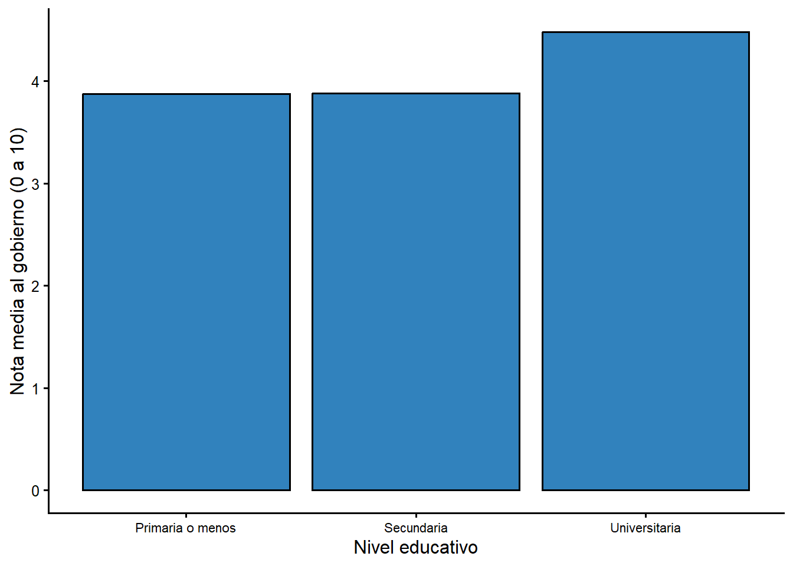

# Analisis de varianza (prueba F): ANOVA

La prueba t compara las medias de **dos** grupos. ¿Que hacemos cuando queremos
comparar **tres o mas** grupos? Si compararamos cada par de grupos con pruebas t
separadas, cometeriamos mas errores de tipo I (cada prueba agrega una oportunidad
de rechazar $H_0$ por azar). El **analisis de varianza (ANOVA)** resuelve el
problema con una sola prueba global basada en la razon **F**. Este capitulo sigue
el material del curso CP-2007 ([@gomez2025]) y de [@levin1999].

## La idea detras del ANOVA

El ANOVA trata la variacion total de un conjunto de puntajes como si se pudiera
dividir en dos componentes:

- la **variacion dentro de los grupos**: la distancia entre cada puntaje y la
  media de su propio grupo; y
- la **variacion entre los grupos**: la distancia entre las medias de los grupos.

La razon **F** compara ambos componentes:

$$F=\frac{\text{variacion entre grupos}}{\text{variacion dentro de los grupos}}$$

Cuanto mayor sea la variacion entre los grupos en relacion con la variacion dentro
de ellos, mayor sera la razon F y mayor la probabilidad de rechazar la hipotesis
nula. La hipotesis nula del ANOVA es que **todas las medias poblacionales de los
grupos son iguales**.

## Procedimiento manual en catorce pasos

Para ilustrar el procedimiento usamos el ejemplo clasico de Levin ([@levin1999]):
¿varia el coeficiente intelectual (C.I.) segun la clase social? Se comparan tres
grupos (alta, media y baja), con cinco observaciones cada uno.


``` r
datos <- data.frame(
  Alta  = c(130, 125, 130, 120, 122),
  Media = c(120, 115, 115, 110, 112),
  Baja  = c(110, 100, 90, 100, 85)
)
datos
  Alta Media Baja
1  130   120  110
2  125   115  100
3  130   115   90
4  120   110  100
5  122   112   85
```

Las hipotesis son:

- $H_0$: las clases alta, media y baja no difieren en su coeficiente intelectual.
- $H_1$: las clases alta, media y baja difieren en su coeficiente intelectual.

Los pasos 1 a 9 calculan la razon F; los pasos 10 a 14 la interpretan y localizan
las diferencias.


``` r
# Paso 1: media de cada grupo
prom_alta  <- mean(datos$Alta)
prom_media <- mean(datos$Media)
prom_baja  <- mean(datos$Baja)

# Tamano total y por grupo
N_total <- nrow(datos) * ncol(datos)
N <- nrow(datos)
k <- ncol(datos)

# Paso 2: suma total de cuadrados
SC_total <- sum(datos^2) - (sum(datos))^2 / N_total

# Paso 3: suma de cuadrados entre grupos
SC_entre <- (sum(datos$Alta)^2 / N + sum(datos$Media)^2 / N +
             sum(datos$Baja)^2 / N) - (sum(datos))^2 / N_total

# Paso 4: suma de cuadrados dentro de los grupos
SC_dentro <- SC_total - SC_entre

# Pasos 5 y 6: grados de libertad
gl_entre <- k - 1
gl_dentro <- N_total - k

# Pasos 7 y 8: medias cuadraticas
MC_entre <- SC_entre / gl_entre
MC_dentro <- SC_dentro / gl_dentro

# Paso 9: razon F experimental
F_exp <- MC_entre / MC_dentro

c(prom_alta = prom_alta, prom_media = prom_media, prom_baja = prom_baja,
  SC_total = SC_total, SC_entre = SC_entre, SC_dentro = SC_dentro,
  F_exp = F_exp)
 prom_alta prom_media  prom_baja   SC_total   SC_entre  SC_dentro 
 125.40000  114.40000   97.00000 2570.93333 2050.53333  520.40000 
     F_exp 
  23.64181 
```


``` r
# Paso 10: valor critico de F (tabla F) para 0,05 con gl 2 y 12
F_teorica <- qf(0.95, gl_entre, gl_dentro)
c(F_experimental = F_exp, F_teorica = F_teorica,
  gl_entre = gl_entre, gl_dentro = gl_dentro)
F_experimental      F_teorica       gl_entre      gl_dentro 
     23.641814       3.885294       2.000000      12.000000 
```

La F experimental (23,64) es mayor que la F teorica (3,89). Por lo tanto,
**rechazamos $H_0$**: si hay diferencias en el coeficiente intelectual segun la
clase social. Ahora necesitamos saber **entre cuales grupos** estan esas
diferencias.


``` r
# Paso 11: diferencias de medias entre todos los pares de grupos
Dif_AltaMedia <- abs(prom_alta - prom_media)
Dif_AltaBaja  <- abs(prom_alta - prom_baja)
Dif_MediaBaja <- abs(prom_media - prom_baja)

# Paso 12: valor q-alpha (tabla del rango studentizado) para k = 3, gl = 12, 0,05
q_alpha <- qtukey(0.95, k, gl_dentro)

# Paso 13: Diferencia Significativa Honesta (DSH) de Tukey
DSH <- q_alpha * sqrt(MC_dentro / N)

c(q_alpha = q_alpha, DSH = DSH,
  AltaMedia = Dif_AltaMedia, AltaBaja = Dif_AltaBaja, MediaBaja = Dif_MediaBaja)
  q_alpha       DSH AltaMedia  AltaBaja MediaBaja 
 3.772929 11.111473 11.000000 28.400000 17.400000 
```

**Paso 14: comparar cada diferencia con la DSH.**

- Alta vs. Media (11) es **menor** que la DSH (11,10): no hay diferencia
  significativa.
- Alta vs. Baja (28,4) es **mayor** que la DSH: si hay diferencia significativa.
- Media vs. Baja (17,4) es **mayor** que la DSH: si hay diferencia significativa.

El analisis confirma que hay diferencias en el coeficiente intelectual segun la
clase social, pero solo entre la clase alta y la baja y entre la media y la baja.
No hay diferencias significativas entre la clase alta y la media.

## Comprobacion con las funciones de R

Para usar `aov()` necesitamos transformar los datos a formato **largo** (una
columna con la clase social y otra con el coeficiente intelectual), usando
`pivot_longer()`.


``` r
library(tidyr)

df_tidy <- datos %>%
  pivot_longer(everything(), names_to = "clase", values_to = "ci") %>%
  mutate(clase = factor(clase, levels = c("Alta", "Media", "Baja")))

df_tidy
# A tibble: 15 × 2
   clase    ci
   <fct> <dbl>
 1 Alta    130
 2 Media   120
 3 Baja    110
 4 Alta    125
 5 Media   115
 6 Baja    100
 7 Alta    130
 8 Media   115
 9 Baja     90
10 Alta    120
11 Media   110
12 Baja    100
13 Alta    122
14 Media   112
15 Baja     85
```


``` r
res_anova <- aov(ci ~ clase, data = df_tidy)
summary(res_anova)
            Df Sum Sq Mean Sq F value   Pr(>F)    
clase        2 2050.5  1025.3   23.64 6.88e-05 ***
Residuals   12  520.4    43.4                     
---
Signif. codes:  0 '***' 0.001 '**' 0.01 '*' 0.05 '.' 0.1 ' ' 1
```

La salida reproduce el procedimiento manual: `Sum Sq` son las sumas de cuadrados,
`Mean Sq` las medias cuadraticas, `F value` la razon F y `Pr(>F)` el valor p. Como
p = 6,88e-05 (mucho menor que 0,05), rechazamos $H_0$.


``` r
# Prueba post hoc de Tukey: ¿que pares de grupos difieren?
TukeyHSD(res_anova)
  Tukey multiple comparisons of means
    95% family-wise confidence level

Fit: aov(formula = ci ~ clase, data = df_tidy)

$clase
            diff       lwr         upr     p adj
Media-Alta -11.0 -22.11147   0.1114733 0.0524062
Baja-Alta  -28.4 -39.51147 -17.2885267 0.0000510
Baja-Media -17.4 -28.51147  -6.2885267 0.0033905
```

La columna `p adj` muestra el valor p ajustado por comparaciones multiples. Las
diferencias Baja-Alta y Baja-Media son significativas (p < 0,05), mientras que
Media-Alta queda justo por encima del umbral (p = 0,052). Los resultados coinciden
con el procedimiento manual.

## Aplicacion con la encuesta del CIEP

¿Depende la evaluacion del gobierno (`nota_gob`, de 0 a 10) del nivel educativo?
Comparamos los tres niveles educativos de la encuesta del CIEP.


``` r
ciep %>%
  filter(!is.na(nota_gob), !is.na(educ_f)) %>%
  group_by(`Nivel educativo` = educ_f) %>%
  summarise(
    n = n(),
    Media = round(mean(as.numeric(nota_gob)), 2),
    `Desv. est.` = round(sd(as.numeric(nota_gob)), 2),
    .groups = "drop"
  )
# A tibble: 3 × 4
  `Nivel educativo`     n Media `Desv. est.`
  <ord>             <int> <dbl>        <dbl>
1 Primaria o menos    228  3.88         3.18
2 Secundaria          384  3.88         2.79
3 Universitaria       343  4.48         2.37
```


``` r
res_ciep <- aov(as.numeric(nota_gob) ~ educ_f, data = ciep)
summary(res_ciep)
             Df Sum Sq Mean Sq F value  Pr(>F)   
educ_f        2     79   39.44   5.214 0.00559 **
Residuals   952   7201    7.56                   
---
Signif. codes:  0 '***' 0.001 '**' 0.01 '*' 0.05 '.' 0.1 ' ' 1
14 observations deleted due to missingness
TukeyHSD(res_ciep)
  Tukey multiple comparisons of means
    95% family-wise confidence level

Fit: aov(formula = as.numeric(nota_gob) ~ educ_f, data = ciep)

$educ_f
                                      diff        lwr       upr
Secundaria-Primaria o menos    0.003015351 -0.5367349 0.5427656
Universitaria-Primaria o menos 0.600941128  0.0493037 1.1525786
Universitaria-Secundaria       0.597925777  0.1182976 1.0775540
                                   p adj
Secundaria-Primaria o menos    0.9999052
Universitaria-Primaria o menos 0.0288229
Universitaria-Secundaria       0.0098203
```

La razon F es 5,21 con un valor p de 0,0056: hay diferencias significativas en la
evaluacion del gobierno segun el nivel educativo. El analisis de Tukey muestra
que la diferencia esta entre quienes tienen educacion universitaria y los otros
dos grupos: las personas con formacion universitaria evaluan mejor al gobierno
(4,48 en promedio) que quienes tienen primaria (3,88) o secundaria (3,89). Entre
primaria y secundaria no hay diferencia significativa.

**Figura \@ref(fig:anova-ciep-fig) Evaluacion del gobierno por nivel educativo, encuesta CIEP 2020**

<div class="figure" style="text-align: center">

<p class="caption">(\#fig:anova-ciep-fig)Nota media al gobierno por nivel educativo, encuesta CIEP 2020</p>
</div>

## ANOVA frente a la prueba t

El ANOVA generaliza la prueba t a mas de dos grupos. De hecho, cuando hay solo dos
grupos, el ANOVA y la prueba t dan la misma conclusion: la razon F es igual al
cuadrado de la razon t. Usamos la prueba t para dos grupos porque es mas directa,
y el ANOVA cuando hay tres o mas.

## Resumen

- El ANOVA contrasta si las medias de tres o mas grupos son iguales.
- La razon F compara la variacion entre grupos con la variacion dentro de ellos.
- Si se rechaza $H_0$, la prueba post hoc de Tukey (DSH) identifica que pares de
  grupos difieren.
- En R, el ANOVA se calcula con `aov()` y las comparaciones multiples con
  `TukeyHSD()`.
