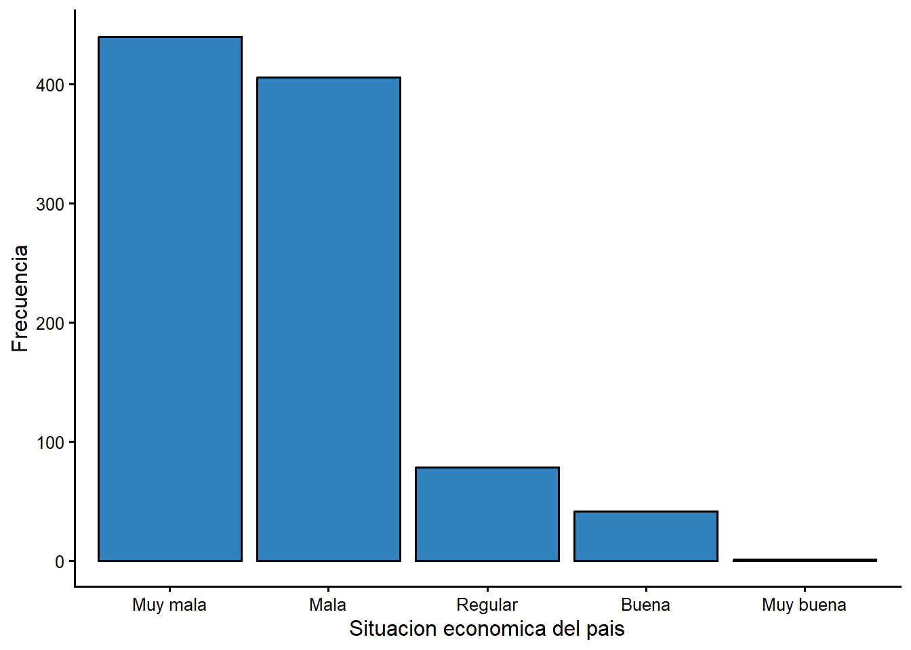
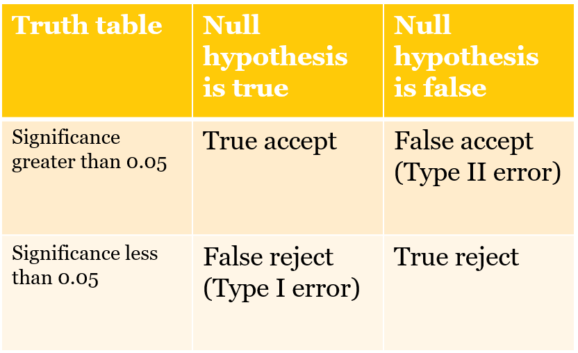

# Medidas de asociacion: el chi-cuadrado

El estadistico de prueba **chi-cuadrado** es apropiado cuando la relacion entre
dos variables puede resumirse con una tabla simple. Puedes usar la tabla para
determinar la direccion de la relacion y si el efecto sobre alguna variable $Y$ es
grande o pequeno, y puedes usar una medida de asociacion (el chi-cuadrado) para
hacer una inferencia sobre la poblacion a partir de los datos de la muestra.

En este capitulo usaremos un ejemplo (el vinculo entre genero y nivel educativo)
para introducir el chi-cuadrado: como se calcula el estadistico, que significa y
como usar el estadistico para evaluar lo que encuentras en una muestra. Tambien
cubrimos la contrastacion de hipotesis y los errores de Tipo I y Tipo II.

## ¿Cual es la distribucion de la percepcion economica hoy?

La encuesta del CIEP incluye una pregunta que pide a las personas calificar la
situacion economica del pais. La distribucion de las respuestas se resume en la
Tabla \@ref(tab:table51).


``` r
tabla51 <- ciep %>%
  filter(!is.na(sit_f)) %>%
  count(sit_f) %>%
  mutate(Porcentaje = round(100 * n / sum(n), 1)) %>%
  select(`Situacion economica` = sit_f, Porcentaje)

kable(tabla51, digits = 1,
      caption = "Fuente: encuesta CIEP-UCR, noviembre 2020.")
```


Table: (\#tab:table51)Fuente: encuesta CIEP-UCR, noviembre 2020.

|Situacion economica | Porcentaje|
|:-------------------|----------:|
|Muy mala            |       45.5|
|Mala                |       42.0|
|Regular             |        8.1|
|Buena               |        4.2|
|Muy buena           |        0.1|


La respuesta mas frecuente es "Muy mala", seguida de "Mala". En 2020, en plena
pandemia, la percepcion de la economia era marcadamente negativa: mas del 85 % de
las personas calificaron la situacion economica como mala o muy mala.

**Figura \@ref(fig:figure_1) Percepcion de la situacion economica del pais**

<div class="figure">

<p class="caption">(\#fig:figure_1)Percepcion de la situacion economica del pais, 2020</p>
</div>

## ¿Deberiamos esperar diferencias entre mujeres y hombres?

¿Hay un vinculo entre el genero y el nivel educativo? ¿Son las mujeres o los
hombres mas propensos a tener estudios universitarios?

Dado lo que ves en la Tabla \@ref(tab:table51), ¿que esperarias observar si
comparamos mujeres y hombres? En Costa Rica, las mujeres han superado a los
hombres en matricula universitaria en las ultimas decadas, asi que podriamos
esperar una mayor proporcion de mujeres con educacion universitaria. Para
contrastar esta expectativa, podemos producir una tabla simple y pedir el
estadistico de prueba chi-cuadrado.

Los datos de la encuesta del CIEP se resumen en la Tabla \@ref(tab:table52). El
estadistico de prueba aparece al final de la tabla.

**Tabla \@ref(tab:table52) Genero y nivel educativo, porcentajes, encuesta CIEP 2020**


``` r
tabla52 <- round(100 * prop.table(table(ciep$sexo_f, ciep$educ_f), margin = 1), 1)
kable(tabla52, digits = 1,
      caption = "Porcentajes por fila. Fuente: CIEP-UCR, noviembre 2020.")
```


Table: (\#tab:table52)Porcentajes por fila. Fuente: CIEP-UCR, noviembre 2020.

|       | Primaria o menos| Secundaria| Universitaria|
|:------|----------------:|----------:|-------------:|
|Mujer  |             26.3|       41.5|          32.2|
|Hombre |             22.1|       38.3|          39.6|


``` r
test1 <- chisq.test(table(ciep$sexo_f, ciep$educ_f))
cat("Chi-cuadrado =", round(unname(test1$statistic), 2),
    ", p =", sprintf("%.3f", test1$p.value),
    ", gl =", test1$parameter, "\n")
Chi-cuadrado = 6.05 , p = 0.049 , gl = 2 
```

La tabla sugiere que hay algunas diferencias en la distribucion del nivel
educativo. Mientras que la categoria mas comun para las mujeres es "Secundaria",
para los hombres la distribucion se inclina un poco mas hacia "Universitaria"
(39,6 % de los hombres frente a 32,2 % de las mujeres). El valor p asociado a esta
tabla es 0,049, justo por debajo de 0,05, asi que el resultado es
**estadisticamente significativo**, aunque por un margen minimo.

El estadistico de prueba (el chi-cuadrado) se calcula comparando el numero real de
personas en cada celda de la tabla con el numero **esperado** de personas en cada
celda. El numero esperado es el que veriamos si la distribucion de los grupos
fuera identica a la de la muestra completa. Los conteos observados y esperados se
reproducen a continuacion.

**Tabla \@ref(tab:table53) Genero y nivel educativo, conteos observados, encuesta CIEP 2020**


``` r
kable(round(test1$observed, 0), caption = "")
```


Table: (\#tab:table53)

|       | Primaria o menos| Secundaria| Universitaria|
|:------|----------------:|----------:|-------------:|
|Mujer  |              134|        211|           164|
|Hombre |              101|        175|           181|


**Tabla \@ref(tab:table54) Genero y nivel educativo, conteos esperados, encuesta CIEP 2020**


``` r
kable(round(test1$expected, 0), caption = "")
```


Table: (\#tab:table54)

|       | Primaria o menos| Secundaria| Universitaria|
|:------|----------------:|----------:|-------------:|
|Mujer  |              124|        203|           182|
|Hombre |              111|        183|           163|


## Pruebas de chi-cuadrado

### ¿Como se calcula el chi-cuadrado?

El estadistico chi-cuadrado (6,05 en la Tabla \@ref(tab:table52)) se calcula
comparando los numeros esperados y observados en cada celda de la tabla (6 celdas
en el ejemplo: 3 columnas por 2 grupos). Para cada celda se toma la diferencia
entre esperado y observado, se eleva al cuadrado, se divide entre el esperado y se
suman todas las celdas. Las diferencias mas grandes entre observado y esperado
contribuyen mas al chi-cuadrado.

### ¿Como se usa el chi-cuadrado?

¿Que aprendemos del chi-cuadrado? Observa que el chi-cuadrado esta asociado a un
**valor p**. Este es el nivel de significancia o valor de probabilidad ($p$). Lo
usamos para determinar si podemos hacer una inferencia sobre la poblacion a partir
de los datos de la muestra.

Si $p < 0,05$, podemos estar bastante confiados de que el resultado que observamos
en la muestra tambien se observara en la poblacion. Si $p > 0,05$, no podemos
hacer esa inferencia. Si $p < 0,05$, decimos que el vinculo entre $X$ y $Y$ es
estadisticamente significativo. En este caso, $p = 0,049$, asi que podemos
concluir que la distribucion del nivel educativo difiere ligeramente entre mujeres
y hombres, pero la diferencia es muy pequena.

### ¿Por que se reportan los estadisticos con un valor de p?

Recuerda que la estadistica se basa en la logica del muestreo repetido. Cada
conjunto de datos es una muestra aleatoria de una poblacion (una de un numero
infinito de muestras aleatorias). Asi, cada muestra produce un valor distinto del
estadistico de prueba. Si repitieramos el procedimiento muchas veces, veriamos que
los estadisticos tienen distribuciones muestrales con propiedades conocidas, lo
que nos permite evaluar la probabilidad de que nuestra muestra provenga de una
poblacion sin vinculo entre $X$ y $Y$. El valor p es simplemente la probabilidad
de que el estadistico observado se extraiga de una distribucion muestral donde el
valor verdadero es cero.

## Contrastacion de hipotesis, errores de Tipo I y Tipo II

El calculo y la divulgacion de valores p estan en el corazon de la contrastacion
de hipotesis en ciencias sociales. Usamos este valor para contrastar lo que se
conoce como **hipotesis nula**. Normalmente usamos teoria, intuicion o experiencia
para formular una expectativa afirmativa sobre como $X$ influira en $Y$ (la
**hipotesis alternativa**). La hipotesis nula es simplemente que no hay vinculo:
que el valor poblacional del estadistico es cero.

Si $p < 0,05$, podemos **rechazar la hipotesis nula**: el estadistico debe ser
distinto de cero en la poblacion. Si $p > 0,05$, aceptamos la nula: probablemente
no hay vinculo entre $X$ y $Y$.

¿Por que existe el estandar de $p < 0,05$? Considera el problema general de la
inferencia. La expectativa de que $X$ influye en $Y$ podria ser verdadera o falsa
en la poblacion, y tu muestra podria respaldar o no tu expectativa. La Tabla
5.5 esquematiza como podria desarrollarse esto.

**Tabla 5.5 Errores de Tipo I y Tipo II**



Puedes cometer uno de dos tipos de error al hacer una inferencia basada en una
muestra. Un **error de Tipo I** es rechazar una hipotesis nula que deberias
aceptar ($X$ no afecta a $Y$, pero concluyes que si). Un **error de Tipo II** es
aceptar una hipotesis nula que deberias rechazar ($X$ si afecta a $Y$, pero
concluyes que no).

Si $p = 0,05$, hay una probabilidad del 5 % de cometer un error de Tipo I. Este es
un estandar arbitrario pero muy extendido en ciencias sociales: solo aceptamos
resultados si la probabilidad de un error de Tipo I es menor al 5 %.

La probabilidad de un error de Tipo II depende principalmente del tamano de la
muestra (muestras pequenas implican alta probabilidad de error de Tipo II). Una
opcion para minimizarlo es recolectar mas datos.

### Ejemplo: ¿que pasa si usamos una muestra pequena?

Podemos evaluar cuanto cambia el chi-cuadrado cuando cambia el tamano de la
muestra. En nuestra muestra original generamos un chi-cuadrado de 6,05 con 2
grados de libertad, con un valor p de 0,049 (significativo).

Puedes calcular el chi-cuadrado para los **mismos porcentajes** (las mismas
distribuciones para mujeres y hombres), pero con una muestra mas pequena. Si uso
una muestra que es una decima parte de la original, veria un chi-cuadrado mucho
menor y un valor p muy por encima de 0,05 (no significativo). La muestra pequena
llevaria a un error de Tipo II. Los numeros aparecen abajo.

**Tabla 5.6 Genero y nivel educativo: chi-cuadrado de la muestra original y de una muestra pequena**


```
n = 966  Chi-cuadrado = 6.05 , p = 0.049 , gl = 2 
n = 97  Chi-cuadrado = 0.6 , p = 0.739 , gl = 2 
```

No rechazar la nula no necesariamente "prueba" que la alternativa es falsa: con
una muestra pequena simplemente no tienes suficientes datos para hacer una
inferencia sobre la poblacion.

## Cuando los errores tienen consecuencias

Equilibrar los errores de Tipo I y Tipo II adquiere una dimension seria cuando los
costos de equivocarse son altos. Por ejemplo, la evaluacion de la seguridad de un
medicamento o de una vacuna implica decisiones con consecuencias graves. La
hipotesis nula seria que el medicamento no es seguro o eficaz. Los datos
experimentales deben rechazar la nula. Un error de Tipo I significa liberar un
medicamento inseguro; un error de Tipo II significa no liberar un medicamento
seguro. ¿Cual es una probabilidad aceptable de error en estos contextos? Depende
de la gravedad de la enfermedad y de la disponibilidad de otros tratamientos. En
ciencias sociales, una probabilidad del 5 % de error de Tipo I es el estandar.
Muestras mas grandes minimizan el error de Tipo II.

## Conclusion

El estadistico chi-cuadrado es util cuando puedes resumir la diferencia entre un
pequeno numero de grupos en una tabla simple. Si las diferencias de grupo son lo
bastante grandes y la muestra es lo bastante grande, veras diferencias
estadisticamente significativas y podras estar confiado de que los grupos son
diferentes en la poblacion.

Usamos un umbral de significancia de 0,05. ¿Cuando es inapropiado $p < 0,05$? En
ciencias sociales, una probabilidad del 5 % de error de Tipo I es el estandar, una
eleccion arbitraria que se remonta a @fisher1926. El autor de la prueba t,
Gossett, sostuvo que el umbral deberia adaptarse a la investigacion concreta,
reflejando los costos de cada tipo de error. Tiene razon: en preguntas de politica
publica seria esencial conocer los costos de un error de Tipo I y de un error de
Tipo II. Incluso la Corte Suprema de Estados Unidos se vio obligada a evaluar el
estandar de significancia estadistica (ver @Matrixx).
