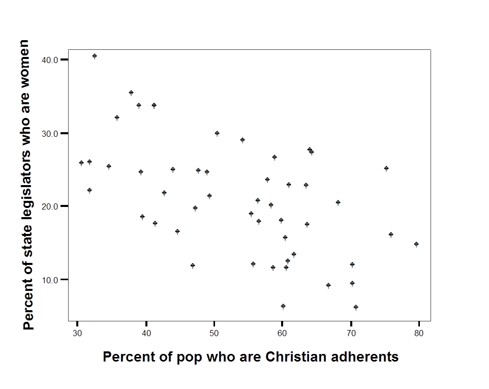
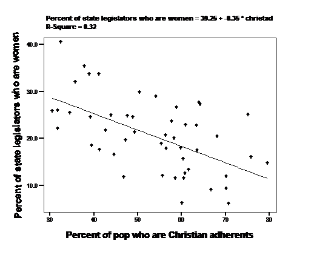
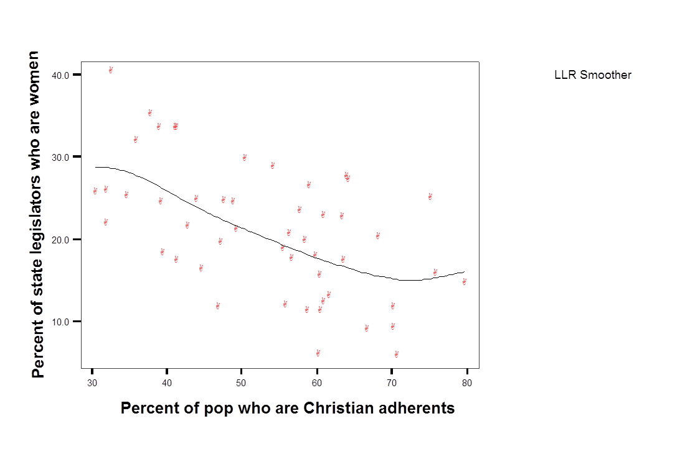

# Regresion

Este capitulo introduce un enfoque de modelado estadistico llamado **regresion**
o **regresion por minimos cuadrados ordinarios** (MCO u OLS). La idea es que
identificamos algo que nos interesa comprender: quizas por que algunas personas
votan o no, por que eligen cierto candidato, si compran un producto o si son
diagnosticadas con cierta enfermedad. Luego seleccionamos un conjunto de cosas que
creemos podrian predecir esos resultados (una teoria guia esas decisiones).
Despues usamos los datos para contrastar el vinculo entre los factores que creemos
importantes (los predictores) y el resultado de interes. MCO es la tecnica que
usamos para determinar que factores importan y cuales no.

La regresion se usa ampliamente en muchos contextos: desde la evaluacion de
programas hasta el marketing y las campanas. Si trabajas en una organizacion que
recolecta y analiza datos de forma rutinaria, alguien usara modelos estadisticos
para interpretarlos, y MCO puede ser una de sus herramientas.

## ¿Por que no usar simplemente medidas de asociacion?

Las medidas de asociacion de los capitulos anteriores permiten evaluar el vinculo
entre una variable dependiente ($Y$) y una variable independiente ($X$) con el
objetivo de determinar:

- ¿cual es la direccion del efecto de $X$ sobre $Y$?;
- ¿es ese efecto grande o pequeno?;
- ¿es el efecto muestral estadisticamente significativo?

Hay dos limitaciones importantes en esas medidas.

Primero, tenemos una capacidad limitada para comunicar o entender la **magnitud**
de la relacion. Si observamos una correlacion de 0,4 entre educacion y nota a la
UCR, ¿que significa? Si, indicaria que quienes tienen mas educacion tienden a
calificar mejor a la UCR, pero ¿cuanto sube la nota por cada nivel educativo?
Esta ambiguedad tambien dificulta comparar directamente el tamano de dos efectos
medidos con medidas de asociacion distintas.

Una segunda limitacion es que solo podemos examinar el efecto de una variable a la
vez. ¿Y si esperamos que dos o mas variables expliquen **conjuntamente** el nivel
de $Y$?

Una alternativa a las medidas de asociacion, el **modelo lineal simple** (la
regresion, o MCO), permite manejar ambos problemas. En este capitulo nos centramos
en un modelo de dos variables, que ayuda con el problema de comunicar informacion
especifica sobre el tamano del efecto. En el capitulo 10 extendemos el modelo para
incluir mas de una variable $X$.

## Regresion por minimos cuadrados ordinarios (MCO)

La regresion lineal supone una "forma funcional" particular para la relacion entre
$X$ y $Y$: que la relacion puede resumirse con una **linea** (y no con una curva u
otra forma). Un modelo lineal tiene esta forma:

$$Y=\beta_0+\beta_1X+\epsilon$$

- $Y$ y $X$ son conocidos (datos).
- $\beta_0$ y $\beta_1$ se estiman.
- $\epsilon$ es un error aleatorio.

Nos interesa principalmente $\beta_1$, y queremos saber dos cosas:

- ¿que podemos inferir sobre la poblacion a partir del $\beta_1$ observado?;
- ¿que nos dice el $\beta_1$ observado sobre la relacion entre $X$ y $Y$ en la
  muestra?

La relacion entre $X$ y $Y$ se supone lineal. Esta suposicion impone cierta
estructura al vinculo que permite resumirlo con unos pocos parametros. Si
recuerdas la geometria, la formula de una recta es:

$$y=mx+b$$

Una recta se describe por completo con dos parametros, $m$ y $b$.

- $b$ es el **intercepto** (el punto donde la recta cruza el eje vertical, $x=0$).
- $m$ es la **pendiente** (subida/avance), o $\Delta Y / \Delta X$.

El modelo lineal tiene la misma forma:

$$Y=\beta_0+\beta_1X$$

- $\beta_0$ es el intercepto.
- $\beta_1$ es la pendiente (el cambio en $Y$ por cada unidad de cambio en $X$).

Asi,

$$\beta_1=\frac{\Delta{Y}}{\Delta{X}}$$

y, reordenando,

$$\Delta{Y} = \Delta{X}*\beta_1$$

Este calculo (el tamano del cambio en $Y$ dado un cambio en $X$) sera la forma
clave de interpretar y comparar el tamano de los efectos con MCO.

### Graficar relaciones entre dos variables

La relacion entre dos variables puede ser lineal o tomar otra forma (en U, una
curva). Una forma de entender la utilidad del modelo lineal es producir un
diagrama de dispersion de $X$ y $Y$ para ver que significa suponer que la relacion
es lineal. El ejemplo siguiente usa datos publicados por @pollock2011. La variable
dependiente (Y) es el porcentaje de legisladoras mujeres en la legislatura estatal
y la variable independiente (X) es el porcentaje de la poblacion estatal que se
adhiere a la fe cristiana. Un diagrama de dispersion para los 50 estados
estadounidenses aparece en la Figura \@ref(fig:figure61).

**Figura \@ref(fig:figure61) Diagrama de dispersion: mujeres en la legislatura estatal segun la proporcion de residentes cristianos**

<div class="figure" style="text-align: center">

<p class="caption">(\#fig:figure61)Mujeres en la legislatura estatal y proporcion de residentes cristianos</p>
</div>

Experimenta dibujando la linea que crees que describe mejor el vinculo entre las
dos variables. La linea es claramente descendente: hay mas mujeres en la
legislatura en los estados con menor proporcion de personas cristianas. Pero la
linea podria ser bastante empinada o bastante plana.

¿Cual es la mejor forma de trazar una linea que describa la relacion? Nos
interesan los dos parametros que describen la linea: la pendiente y el intercepto.
¿Que criterio usamos para elegir una linea sobre otra? El criterio que usamos es
**minimizar la suma de los errores al cuadrado**. La recta de regresion real se
agrega a los datos en la Figura \@ref(fig:figure62).

**Figura \@ref(fig:figure62) Diagrama de dispersion con la recta MCO**

<div class="figure" style="text-align: center">

<p class="caption">(\#fig:figure62)Diagrama de dispersion con la recta de regresion</p>
</div>

La recta que mejor se ajusta a los datos tiene una pendiente de -0,35. Como $Y$ es
el porcentaje de legisladoras y $X$ el porcentaje de poblacion cristiana, sabemos
que $\Delta Y = \Delta X * \beta_1$. Si comparamos un estado con 70 % de personas
cristianas con uno de 50 % ($\Delta X = 20$), esperariamos ver -0,35*20, es decir,
una caida de 7 puntos en el porcentaje previsto de legisladoras.

### Calculo en el modelo lineal simple

La regresion resume los datos con una linea que minimiza la suma del error al
cuadrado ($\epsilon^2$). Para el modelo bivariado, el calculo de $\beta_1$ es
simple:

$$\beta_1 =\frac{\sum((X-\mu_x)(Y-\mu_y))} {\sum(X-\mu_x)^2} $$

En palabras, la covarianza de $X$ y $Y$ dividida entre la varianza de $X$.

Una vez que tenemos $\beta_1$, calculamos el intercepto:

$$\beta_0=\mu_y-(\mu_x*\beta_1)$$

En palabras, la media de $Y$ menos el producto de la media de $X$ y $\beta_1$.

No nos importa mucho el termino constante, porque nos interesa comparar niveles
entre grupos: las diferencias de grupo importan mas que si todos los grupos estan
altos o bajos en $Y$. La formula del intercepto asegura que el valor promedio de
$X$ este asociado al valor promedio de $Y$.

### ¿Que tan restrictiva es la suposicion de linealidad?

El diagrama de dispersion de la Figura \@ref(fig:figure62) revela dos cosas.
Primero, hay mucho error: es una relacion "ruidosa". Segundo, parece razonable
usar una linea para describir los datos. Podemos evaluarlo permitiendo que $X$ y
$Y$ se vinculen de otra forma. La Figura \@ref(fig:figure63) resume los puntos con
un "suavizador" local. Incluso con este enfoque muy flexible, la relacion parece
cercana a lineal.

**Figura \@ref(fig:figure63) Diagrama de dispersion con suavizador local**

<div class="figure" style="text-align: center">

<p class="caption">(\#fig:figure63)Diagrama de dispersion con suavizador local</p>
</div>

## Interpretar los coeficientes de regresion

El modelo lineal supone que $Y$ es una funcion lineal de $X$. Los datos se usan
para contrastar si la relacion (la pendiente) es positiva, negativa o cero.
Deberias tener una idea de lo que esperas observar antes de generar la salida.
Esta expectativa se conoce como **hipotesis alternativa**. En el modelo lineal
simple contrastamos nuestras expectativas examinando el **signo** de $\beta_1$.

Una prueba t se usa para determinar si la diferencia entre el $\beta_1$ observado y
cero es estadisticamente significativa. La hipotesis nula es que $\beta_1 = 0$ en
la poblacion; la alternativa es que $\beta_1 \neq 0$.

Si $p < 0,05$, entonces en la poblacion $\beta_1$ no es igual a cero (rechazas la
nula). La relacion entre $X$ y $Y$ es estadisticamente significativa.

Para ver como funciona la regresion en la practica, usamos dos ejemplos: el
vinculo entre la nota al gobierno y el apoyo al sistema, y el vinculo entre la
nota al gobierno y la edad.

#### **Ejemplo: evaluacion del gobierno y apoyo al sistema**

**Tabla 9.1 Nota al gobierno en funcion del apoyo al sistema**


```

=================================
                 Nota al gobierno
---------------------------------
Apoyo al sistema     0.576***    
                    p = 0.000    
                                 
Constante            1.200***    
                   p = 0.00000   
                                 
N                      923       
R2                    0.153      
Adjusted R2           0.152      
=================================
```

Por cada unidad de aumento en el apoyo al sistema (de 1 a 2, de 2 a 3, etc.), la
nota al gobierno aumenta 0,58 puntos. Asi, la diferencia entre quien no apoya nada
al sistema (1) y quien lo apoya mucho (7) es igual a (7-1)*0,58 = 3,45 puntos en
la escala de 0 a 10.

El tamano aproximado del efecto en la muestra es:

$$(X_{max}-X_{min}) * \beta_1$$

Observa que el nivel de significancia asociado al coeficiente esta por debajo de
0,05 (p < 0,001). Esta relacion es estadisticamente significativa. Podemos estar
confiados de que, en la poblacion, quienes mas apoyan al sistema evaluan mejor al
gobierno.

#### **Ejemplo: nota al gobierno y edad**

En el capitulo 4 vimos el vinculo entre la edad y la evaluacion de los partidos.
Ahora consideramos si la edad predice la nota al gobierno. Si $Y$ es la nota al
gobierno (0 a 10) y $X$ es la edad, esperariamos que las personas mayores evaluen
de forma distinta al gobierno.

**Tabla 9.2 Nota al gobierno y edad**


```

============================
            Nota al gobierno
----------------------------
Edad             -0.005     
               p = 0.355    
                            
Constante       4.320***    
               p = 0.000    
                            
N                 940       
R2               0.001      
Adjusted R2     -0.0002     
============================
```

¿Que aprendemos? Por cada ano de edad, la nota al gobierno cambia en -0,005
puntos. Es decir, entre una persona de 20 y una de 80 anos ((80-20)*-0,005 = -0,3
puntos) practicamente no hay diferencia. Ademas, el valor p es 0,355, asi que el
resultado **no** es estadisticamente significativo. No hay una relacion lineal
entre la edad y la nota al gobierno.

La interpretacion del coeficiente ($\beta_1$) es la clave para explicar los
resultados de una regresion.

## Contrastacion de hipotesis con MCO

Ademas de usar la salida de la regresion para conocer la direccion y el tamano de
la relacion, tambien la usamos para evaluar la significancia estadistica y que tan
bien el modelo se ajusta a los datos.

### Una nota tecnica sobre la prueba t

La prueba t es simplemente una prueba t de una muestra sobre si $\beta_1 = 0$:

$$t=\frac{\beta_1-0}{\sigma_{\beta_1}} $$

El termino de arriba es la diferencia entre el coeficiente observado y cero. El de
abajo es la desviacion estandar del coeficiente.

### El error de muestreo o desviacion estandar de $\beta_1$

El coeficiente de pendiente tiene una distribucion muestral como otras medidas de
asociacion. Si tomaras varias muestras, el promedio de las pendientes seria la
pendiente poblacional y la desviacion estandar del coeficiente seria:

$$\sigma_{\beta_1} =\frac{\sum\epsilon^2} {\sum(X_i-\mu_x)^2 *(n-2)}$$

En palabras, la suma de errores al cuadrado dividida entre la varianza de $X$
multiplicada por n-2. Esto significa que esperariamos mucha incertidumbre sobre
las estimaciones (varianza alta de $\beta_1$) en tres condiciones:

- cuando n no es grande (n-2 es pequeno);
- cuando el rango de $X$ es estrecho (varianza de $X$ pequena); o
- cuando hay mucho error o ruido (suma de errores al cuadrado grande).

Nota las implicaciones para el diseno de investigacion: si el objetivo es la
precision, queremos un n grande, valores de $X$ en todo su rango y un modelo bien
especificado (pocos errores).

## Evaluar la bondad de ajuste

Ademas de los coeficientes y la prueba de significancia, la salida de regresion
incluye una medida util de la "bondad de ajuste": la **R^2^** (R cuadrada). El
calculo es:

$$R^2=1-\frac{\sum(Y-\widehat{Y})^2}{\sum(Y-\mu_y)^2}$$

La parte de arriba del segundo termino se conoce como "suma de residuos al
cuadrado": la suma de las diferencias de cada $Y$ individual respecto al $Y$
previsto ($\widehat{Y}$). La parte de abajo es la suma total de cuadrados, que es
lo mismo que la varianza de Y.

El valor de R^2^ esta acotado entre cero y uno. Nunca puedes hacerlo peor que
adivinar que todos tomaran el valor medio de la variable. Si tu modelo predijera
perfectamente el resultado, el segundo termino seria cero y R^2^ seria uno. Un
R^2^ bajo (cercano a cero) indica que el modelo no se ajusta bien a los datos. En
el ejemplo de la edad, la R^2^ es practicamente cero, asi que es un modelo que no
se ajusta a los datos. En el ejemplo del apoyo al sistema, la R^2^ es 0,153:
alrededor del 15 % de la variacion en la nota al gobierno se explica por el apoyo
al sistema.

### Usar la R^2^ en la practica

La R^2^ no es util para comparar tipos de modelos muy distintos (distintos niveles
de agregacion o variables dependientes muy diferentes). Si es util para comparar
el rendimiento general de modelos similares. La mejor forma de entender la R^2^
es que reporta la proporcion de la suma de cuadrados explicada por el modelo.

## Variables dummy

Algunas situaciones de investigacion exigen usar variables categoricas o nominales
(estado civil, provincia, genero, religion) en el modelo lineal. Usamos variables
**dummy** o indicadoras para incluir este tipo de datos.

Por ejemplo, la provincia se codifica como 0 (costera) y 1 (central). ¿Hay alguna
razon para esperar que "central" sea el doble de algo que "costera"? No. Una
alternativa es crear una variable que identifique a las personas de un grupo de
interes como "1" y al resto como "0".

### Ejemplos de variables dummy

#### Genero

Si nos interesara la diferencia entre hombres y mujeres, podriamos crear una
variable dummy con dos categorias:

$$ X_1=
    \begin{cases}
      0, & \text{si es Mujer} \\
      1, & \text{si es Hombre}
    \end{cases}$$

Recuerda que $Y=\beta_0+\beta_1X_1$. Cuando $X$ es una dummy, el valor previsto de
$Y$ es igual a la constante si $X = 0$:

$$Y=\beta_0$$

Para $X = 1$, el valor previsto de $Y$ es la constante mas el coeficiente:

$$Y=\beta_0+\beta_1$$

El ejemplo siguiente usa una variable dummy de genero para predecir la nota al
gobierno.

**Tabla 9.3 Nota al gobierno y genero**


```

===============================
               Nota al gobierno
-------------------------------
Hombre (dummy)      -0.292     
                  p = 0.104    
                               
Constante          4.226***    
                  p = 0.000    
                               
N                    952       
R2                  0.003      
Adjusted R2         0.002      
===============================
```

Los numeros nos dicen:

- Para mujeres, $Y$ = 4,23 + (-0,29)*0 = 4,23
- Para hombres, $Y$ = 4,23 + (-0,29)*1 = 3,93

El efecto no es estadisticamente significativo (p = 0,104), asi que no podemos
concluir que hombres y mujeres difieran en su evaluacion del gobierno.

#### Educacion

Usando una dummy para educacion, podriamos comparar directamente el efecto de la
educacion con el efecto del genero. Si la comparacion de interes es tener
educacion universitaria frente al resto, podriamos crear una dummy que tome dos
valores: 0 (primaria o secundaria) y 1 (universitaria).

**Tabla 9.4 Nota al gobierno y educacion universitaria**


```

======================================
                      Nota al gobierno
--------------------------------------
Universitaria (dummy)     0.599***    
                         p = 0.002    
                                      
Constante                 3.879***    
                         p = 0.000    
                                      
N                           955       
R2                         0.011      
Adjusted R2                0.010      
======================================
```

La salida nos dice que, para quienes no tienen educacion universitaria,
$Y$ = 3,88. Para quienes si la tienen, $Y$ = 3,88 + 0,60 = 4,48. Hay una
diferencia de 0,60 puntos, y es estadisticamente significativa. La R^2^ es mayor
que en el caso del genero, asi que la educacion predice mejor la nota al gobierno
que el sexo.

### ¿Que pasa si $X$ tiene mas de dos categorias?

Si quieres usar una variable con muchas categorias, necesitas varias variables
dummy. Si tienes N categorias, necesitas N-1 dummies. En los ejemplos anteriores
teniamos dos categorias, asi que necesitabamos una dummy. Si quisieramos contrastar
diferencias entre las tres categorias educativas (primaria, secundaria,
universitaria), necesitariamos dos dummies, tomando una categoria como **base**.
Tomamos "Primaria o menos" como base.

**Tabla 9.5 Nota al gobierno y nivel educativo (tres categorias)**


```

==============================
              Nota al gobierno
------------------------------
Secundaria        0.425**     
                 p = 0.011    
                              
Universitaria      0.243      
                 p = 0.105    
                              
Constante         4.079***    
                 p = 0.000    
                              
N                   955       
R2                 0.011      
Adjusted R2        0.009      
==============================
```

La persona base (primaria o menos) tiene un valor previsto de 3,88. Quienes tienen
secundaria no difieren de la base (coeficiente 0,003, no significativo). Quienes
tienen educacion universitaria tienen una nota prevista 0,60 puntos mayor. La R^2^
de este modelo es un poco mayor que usando una sola dummy, asi que el modelo se
ajusta un poco mejor.

## Resumen

El modelo lineal expresa la relacion entre dos variables. La variable dependiente
es predecible (mas o menos) a partir de la variable independiente. Los coeficientes
de regresion son medidas de asociacion entre las variables y expresan magnitud y
direccion. Cada coeficiente se contrasta con una prueba t para saber si difiere de
cero en la poblacion. La R^2^ resume en que medida las variables independientes
explican el nivel de la variable dependiente. Las variables dummy permiten
comparar grupos que no se pueden ordenar de forma significativa.
