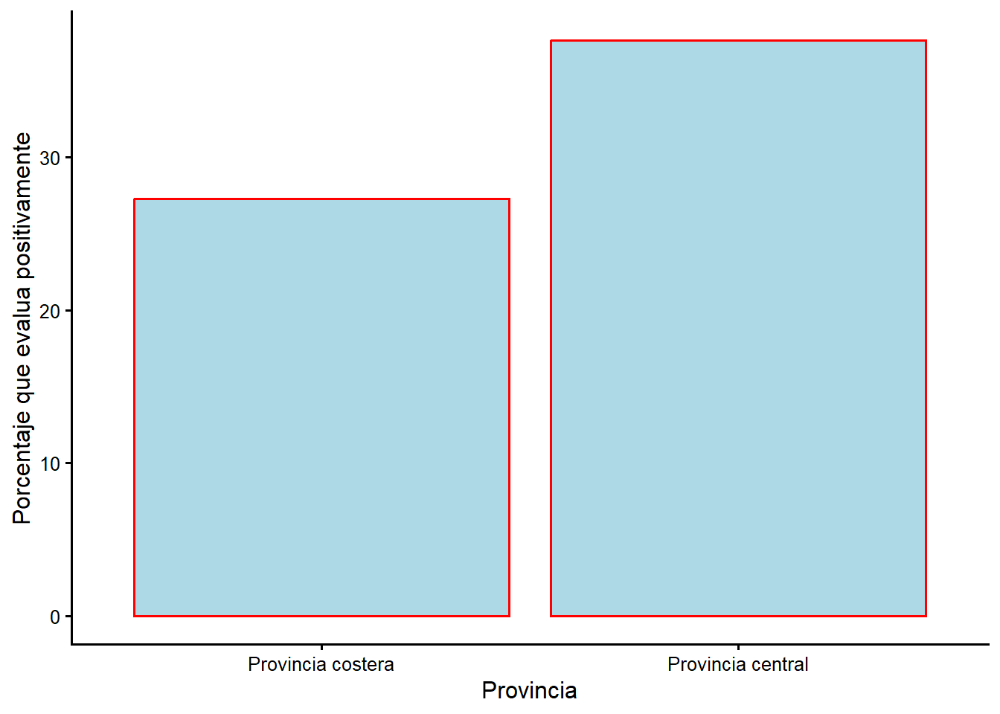
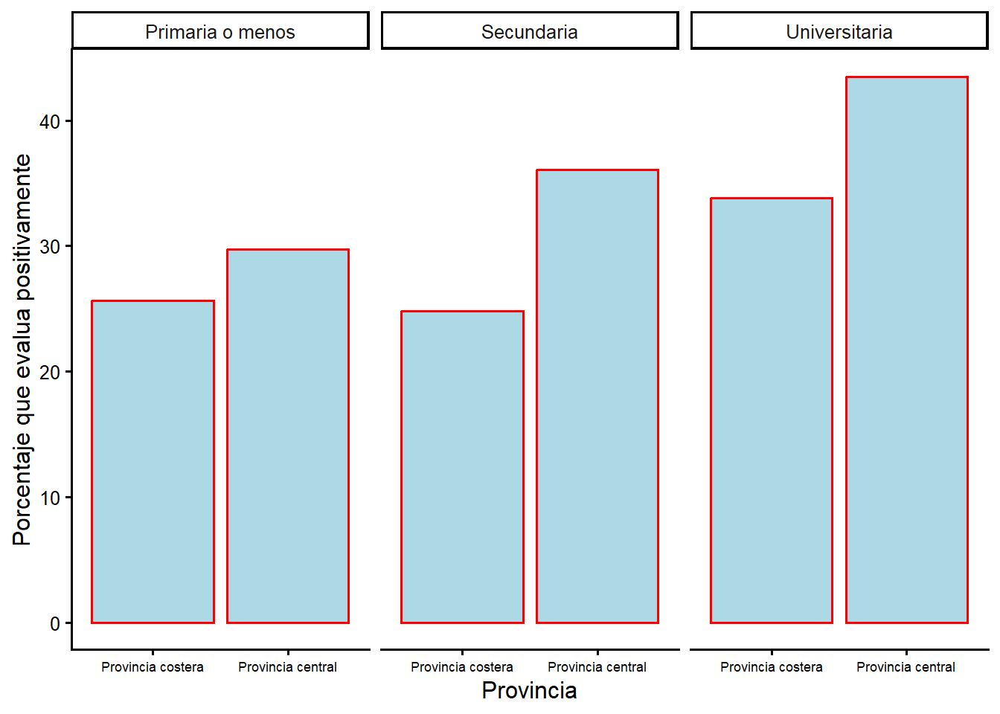

# Modelos estadisticos con muchos predictores

Este capitulo introduce el modelo estadistico mas usado en las ciencias sociales
y el bloque de construccion de modelos mas complejos que han surgido para
enfrentar retos de investigacion especificos.

El modelo lineal simple con mas de un predictor se conoce como **modelo
multivariado** o **regresion multiple**. Las ciencias sociales usan este enfoque
para estudiar comportamiento, evaluar politicas publicas o pronosticar eventos.
Tambien es la base de modelos mas complejos en campos que van de la salud publica
a las ciencias ambientales. Nos interesa el modelo multivariado porque ofrece una
forma flexible de evaluar simultaneamente los efectos de muchos predictores en un
mismo conjunto de pruebas. Podemos aislar el efecto de un factor "controlando" por
una variedad de otros factores.

## ¿Que es la comparacion controlada?

Recuerda la distincion entre investigacion experimental y observacional. La
investigacion experimental en ciencias sociales aparece tanto en el trabajo de
politicas publicas (las personas usuarias se asignan al azar a control o
intervencion) como en encuestas o experimentos de laboratorio (los sujetos se
exponen a informacion o situaciones distintas). En este curso dependemos de un
enfoque observacional, usando una muestra de potenciales votantes. El reto es que
podriamos querer comparar dos grupos (por ejemplo, personas jovenes y mayores),
pero no podemos aislar el efecto solo de la edad. Las personas mayores tienen, en
promedio, mas problemas de salud, menor nivel educativo y viven en lugares
distintos. Para aislar el efecto de la edad (o de cualquier $X$ que nos importe)
debemos "controlar" por otras diferencias entre los grupos.

La suposicion basica del modelo lineal simple es que el predictor principal que
nos interesa ($X$) tiene un vinculo con el comportamiento o actitud que
investigamos ($Y$). La **comparacion controlada** consiste en considerar una
tercera variable, $Z$, relacionada tanto con $X$ como con $Y$. La pregunta es:
¿se mantiene el vinculo entre $X$ y $Y$ si lo examinas en distintos niveles de
$Z$?

Podemos ampliar la investigacion para incluir varias variables de control. Esta es
la logica de la comparacion controlada. Por ejemplo, si nos interesa como el nivel
educativo ($X$) influye en el voto por el PAC ($Y$), quizas queramos controlar por
la provincia ($Z$). Sabemos que la provincia esta vinculada con el voto y con la
educacion, asi que nuestra comprension del vinculo podria estar distorsionada.

Considera lo que podria ocurrir al contrastar el vinculo entre $X$ y $Y$ en
distintos niveles de $Z$:

- Podrias no ver cambios respecto a la investigacion original: $X$ afecta a $Y$
  de la misma manera en todos los niveles de $Z$. Esto se llama efecto
  **aditivo**.
- Podrias descubrir que un vinculo entre $X$ y $Y$ que parecia importante se
  reduce a cero al controlar por $Z$. En ese caso el resultado original se llama
  **espurio**.
- Podria ser que no encuentres vinculo entre $X$ y $Y$, pero que el vinculo emerja
  al hacer una comparacion controlada. Esto seria un ejemplo de **confusion**
  (confounding).
- Finalmente, podrias encontrar que el vinculo entre $X$ y $Y$ es distinto segun
  los niveles de $Z$ (positivo en unos subgrupos y negativo en otros). Esto se
  conoce como efecto **interactivo**.

En los capitulos anteriores describimos tres formas de usar tablas y figuras para
mostrar el vinculo entre dos variables: tablas de contingencia, graficos de barras
y graficos de lineas. Podemos usar las mismas estrategias para implementar una
comparacion controlada.

### Provincia y voto: tabulacion cruzada con una variable de control

A veces se afirma que ciertas regiones de un pais son politicamente distintivas.
En Costa Rica, la provincia central concentra la capital y el mayor desarrollo
economico, mientras que las provincias costeras son mas rurales. ¿Vota distinto la
provincia central? ¿Se debe esa diferencia a la composicion educativa de cada
region, o se mantiene al controlar por educacion?

La Tabla \@ref(tab:table71) muestra el porcentaje de voto por el PAC segun la
provincia.

**Tabla \@ref(tab:table71) Voto por el PAC, por provincia, 2020**

Table: (\#tab:table71)Fuente: encuesta CIEP-UCR, noviembre 2020.

|Provincia         | Porcentaje voto PAC|
|:-----------------|-------------------:|
|Provincia costera |                31.2|
|Provincia central |                52.0|

Hay una diferencia considerable: el PAC obtuvo alrededor del 52 % en la provincia
central frente a poco mas del 31 % en las provincias costeras. ¿Que podria estar
distorsionando esta relacion? Una caracteristica que distingue a las regiones es
el nivel educativo: la provincia central concentra la mayor proporcion de personas
con educacion universitaria, y ya vimos que la educacion se asocia con el voto por
el PAC. Entonces necesitamos **controlar por educacion** para aclarar el vinculo
entre provincia y voto. La Tabla \@ref(tab:table72) reporta la comparacion
controlada.

**Tabla \@ref(tab:table72) Voto por el PAC en la provincia central y costera, por nivel educativo, 2020**

Table: (\#tab:table72)Fuente: encuesta CIEP-UCR, noviembre 2020.

|Nivel educativo  |Provincia         | Porcentaje|
|:----------------|:-----------------|----------:|
|Primaria o menos |Provincia costera |       27.3|
|Primaria o menos |Provincia central |       28.5|
|Secundaria       |Provincia costera |       22.4|
|Secundaria       |Provincia central |       43.4|
|Universitaria    |Provincia costera |       50.8|
|Universitaria    |Provincia central |       71.3|

Las diferencias regionales siguen presentes, e incluso se agrandan, cuando
controlamos por educacion. Entre quienes tienen secundaria, el voto por el PAC es
22 % en la costa y 43 % en el centro; entre quienes tienen educacion universitaria,
51 % en la costa y 71 % en el centro. La composicion educativa de cada region
**confundia** en parte nuestra comprension: la diferencia regional no desaparece,
se mantiene (e incluso crece) dentro de cada nivel educativo. Esto es un ejemplo
de efecto **aditivo/interactivo**: la provincia importa, y su efecto es mayor entre
quienes tienen mas educacion.

### Evaluacion del gobierno y provincia: graficos de barras con control

Tambien podemos ilustrar la comparacion controlada con la evaluacion del gobierno.
La Figura \@ref(fig:figure71) resume la proporcion de personas que evaluan
positivamente la gestion del gobierno segun la provincia.

**Figura \@ref(fig:figure71) Evaluacion positiva de la gestion, por provincia, 2020**

(\#fig:figure71)Evaluacion positiva de la gestion del gobierno por provincia

La Figura \@ref(fig:figure72) desglosa el vinculo entre provincia y evaluacion del
gobierno en los tres niveles educativos: una comparacion controlada. Ahora podemos
entender el vinculo entre la evaluacion y la provincia para personas con niveles
educativos similares.

**Figura \@ref(fig:figure72) Evaluacion de la gestion por provincia, controlando por educacion, 2020**

(\#fig:figure72)Evaluacion de la gestion por provincia, controlando por educacion

Los datos sugieren que la provincia central evalua mejor la gestion en todos los
niveles educativos. La educacion y la provincia parecen ejercer efectos
independientes sobre la evaluacion del gobierno. Este es un buen ejemplo de
efectos **aditivos**.

## Entonces, ¿como encaja un modelo estadistico en todo esto?

Hay dos razones por las que no podemos usar tablas y figuras de forma fiable para
estas comparaciones controladas. En algunos casos, $Z$ tiene muchas categorias, lo
que implica demasiadas tablas o demasiadas barras. Ademas, en cuanto empiezas a
pensar en varias variables de control, la estrategia se derrumba por completo. Por
ejemplo, si quisieras revisar el vinculo entre $X$ y $Y$ para cada combinacion
posible de provincia (2), genero (2), educacion (3) y edad (varias), necesitarias
decenas de tablas separadas, cada una con pocas personas.

Como alternativa a mirar explicitamente el vinculo entre $X$ y $Y$ para cada valor
de $Z$, podemos simplemente **agregar la variable de control al modelo lineal**.
Ese paso resulta ser equivalente a mirar la pendiente para cada subgrupo posible y
promediar entre todos esos grupos.

Para el modelo lineal simple, recordamos que suponemos una forma funcional:

$$Y=\beta_0+\beta_1X+\epsilon$$

El modelo multivariado es conveniente porque es facil agregar multiples variables
explicativas. Tus intuiciones sobre "que importa" y las expectativas teoricas
deben guiar tu eleccion de variables. El proceso de decidir que variables incluir
se llama **especificacion del modelo**. La forma general es:

$$Y=\beta_0+\beta_1X_1+\beta_2X_2+\beta_3X_3+\epsilon$$

Nos centramos en tres formas en que el modelo multivariado difiere del de dos
variables:

- los coeficientes se interpretan de forma ligeramente distinta;
- usamos la R cuadrada **ajustada** (en lugar de la R cuadrada) para evaluar que
  modelos se ajustan mejor; y
- introducimos los **coeficientes estandarizados** para entender que variables
  importan mas.

## El modelo multivariado

### Coeficientes parciales frente a coeficientes completos

Para el modelo bivariado, el calculo de $\beta_1$ es simple. La interpretacion es
facil: $\beta_1$ describe cuanto cambia $Y$ por un cambio de una unidad en $X$.

En el modelo multivariado la interpretacion es algo mas complicada. El coeficiente
describe cuanto cambia $Y$ por un cambio de una unidad en X~1~, **manteniendo
constantes las demas X**.

El efecto de X~1~ ($\beta_1$) en el modelo multivariado es un efecto **parcial**
(distinto del efecto **completo** que se observa en el modelo bivariado). La idea
crucial es que la unica forma en que importa introducir una variable de control es
si esa variable esta realmente relacionada con la variable que te interesa. Cuanto
mayor sea la covarianza entre X~1~ y X~2~, mayor sera la diferencia entre los
coeficientes de los dos modelos.

Una implicacion: siempre deberias entender la correlacion entre cada par de
variables $X$ de un modelo.

### R cuadrada ajustada

La R cuadrada tiene limitaciones para comparar el rendimiento de dos modelos
multivariados. Cada vez que agregas una variable $X$, la R cuadrada aumenta. Dado
esto, agregariamos TODAS las variables posibles para maximizar la R cuadrada. Pero
tambien es bueno tener un modelo simple. Para "premiar" los modelos simples,
usamos una medida alternativa de bondad de ajuste: la **R cuadrada ajustada**.

$$R^2_{adj} = 1-\frac{(1-R^2)(n-1) } {n-k-1}$$

La R cuadrada ajustada puede ser muy cercana a la R cuadrada si tienes una muestra
muy grande y pocos predictores. En el ejemplo de abajo, los dos numeros son
parecidos porque tenemos pocos predictores y cientos de observaciones. Pero con
muestras mas pequenas es convencional usar la R cuadrada ajustada. Si dos modelos
de la misma $Y$ tienen distinto numero de variables $X$, deberias usar la R
cuadrada ajustada para compararlos.

### ¿Como determinamos que importa de verdad? Los coeficientes estandarizados

En el modelo multivariado puedes usar dos piezas de informacion para determinar
que $X$ es mas importante para predecir $Y$:

1. Determinar el rango de cada $X$ ($\Delta X$) y multiplicarlo por su coeficiente,
   para comparar el tamano del efecto sobre $Y$.
2. Usar un **coeficiente estandarizado** (que se etiqueta $\beta^*$). El calculo
   es:

$$\beta_1^*=\beta_1 * \frac{\sigma_x}{\sigma_y}$$

El coeficiente estandarizado con el mayor valor absoluto tiene el mayor efecto:
dice cuanto cambia $Y$ (en desviaciones estandar) por cada aumento de una
desviacion estandar en $X$. Un vistazo rapido a los coeficientes estandarizados te
permite ordenar el tamano de los efectos de mayor a menor, algo que no puedes
hacer con los coeficientes sin estandarizar.

## Un ejemplo: usar el modelo multivariado para entender la evaluacion del gobierno

El vinculo entre la evaluacion del gobierno y el apoyo al sistema nos ayudo a
entender la correlacion y la regresion. Abajo consideramos si la nota al gobierno
esta impulsada por el apoyo al sistema, por la percepcion de la economia o por
ambos. Tambien consideramos un modelo mas amplio para ver como se usan los
coeficientes estandarizados.

Los modelos de una sola variable que predicen la nota al gobierno se reproducen en
la Tabla 10.3. La primera columna reporta el vinculo con el apoyo al
sistema; la segunda, el vinculo con el voto por el PAC.

**Tabla 10.3 Dos modelos bivariados que predicen la nota al gobierno**

<table style="text-align:center"><tr><td colspan="3" style="border-bottom: 1px solid black"></td></tr><tr><td style="text-align:left"></td><td colspan="2">Nota al gobierno</td></tr>
<tr><td style="text-align:left"></td><td>(1)</td><td>(2)</td></tr>
<tr><td colspan="3" style="border-bottom: 1px solid black"></td></tr><tr><td style="text-align:left">Apoyo al sistema</td><td>0.576***</td><td></td></tr>
<tr><td style="text-align:left"></td><td>p = 0.000</td><td></td></tr>
<tr><td style="text-align:left"></td><td></td><td></td></tr>
<tr><td style="text-align:left">Voto PAC</td><td></td><td>1.248***</td></tr>
<tr><td style="text-align:left"></td><td></td><td>p = 0.000</td></tr>
<tr><td style="text-align:left"></td><td></td><td></td></tr>
<tr><td style="text-align:left">Constante</td><td>1.200***</td><td>3.443***</td></tr>
<tr><td style="text-align:left"></td><td>p = 0.00000</td><td>p = 0.000</td></tr>
<tr><td style="text-align:left"></td><td></td><td></td></tr>
<tr><td style="text-align:left"><em>N</em></td><td>923</td><td>798</td></tr>
<tr><td style="text-align:left">R2</td><td>0.153</td><td>0.050</td></tr>
<tr><td style="text-align:left">Adjusted R2</td><td>0.152</td><td>0.049</td></tr>
<tr><td colspan="3" style="border-bottom: 1px solid black"></td></tr></table>

Observa que el coeficiente del apoyo al sistema es 0,58 y el del voto por el PAC es
1,25. La R cuadrada es mayor en el modelo que usa el apoyo al sistema (0,153) que
en el del voto (0,050). ¿Como puede ser que el efecto mas grande (el voto) tenga
una R cuadrada menor? Porque el apoyo al sistema se distribuye en toda la escala
de 1 a 7, mientras que el voto es una dummy con dos valores; la variacion que
explica el apoyo al sistema es mayor. Para resolver la incertidumbre sobre cual
variable importa mas, podemos contrastar el vinculo en un solo modelo
multivariado.

**Tabla 10.4 Un modelo multivariado que predice la nota al gobierno, con apoyo al sistema y voto por el PAC**

<table style="text-align:center"><tr><td colspan="2" style="border-bottom: 1px solid black"></td></tr><tr><td style="text-align:left"></td><td>Nota al gobierno</td></tr>
<tr><td colspan="2" style="border-bottom: 1px solid black"></td></tr><tr><td style="text-align:left">Apoyo al sistema</td><td>0.546***</td></tr>
<tr><td style="text-align:left"></td><td>p = 0.000</td></tr>
<tr><td style="text-align:left"></td><td></td></tr>
<tr><td style="text-align:left">Voto PAC</td><td>1.030***</td></tr>
<tr><td style="text-align:left"></td><td>p = 0.00000</td></tr>
<tr><td style="text-align:left"></td><td></td></tr>
<tr><td style="text-align:left">Constante</td><td>0.821***</td></tr>
<tr><td style="text-align:left"></td><td>p = 0.002</td></tr>
<tr><td style="text-align:left"></td><td></td></tr>
<tr><td style="text-align:left"><em>N</em></td><td>772</td></tr>
<tr><td style="text-align:left">R2</td><td>0.195</td></tr>
<tr><td style="text-align:left">Adjusted R2</td><td>0.193</td></tr>
<tr><td colspan="2" style="border-bottom: 1px solid black"></td></tr></table>

| Coeficientes estandarizados |     |
| :-------------------------- | :-- |
| Apoyo al sistema            | 0.37 |
| Voto por el PAC             | 0.19 |

La tabla nos dice tres cosas. Usando los niveles de significancia, sabemos que
tanto el apoyo al sistema como el voto por el PAC importan: ambos efectos son
positivos y significativos. Pero tambien aprendemos que el apoyo al sistema es el
efecto mas poderoso: su coeficiente estandarizado es 0,37, mas lejos de cero que
el del voto (0,19). Los coeficientes sin estandarizar refuerzan esta conclusion.

Podriamos usar una estrategia similar para evaluar una serie de variables. La
Tabla 10.5 reporta los coeficientes de un modelo complejo: apoyo al
sistema, percepcion economica, educacion, genero, edad, voto por el PAC y
provincia.

**Tabla 10.5 Un modelo multivariado que predice la nota al gobierno, con varios predictores**

<table style="text-align:center"><tr><td colspan="2" style="border-bottom: 1px solid black"></td></tr><tr><td style="text-align:left"></td><td>Nota al gobierno</td></tr>
<tr><td colspan="2" style="border-bottom: 1px solid black"></td></tr><tr><td style="text-align:left">Apoyo al sistema</td><td>0.475***</td></tr>
<tr><td style="text-align:left"></td><td>p = 0.000</td></tr>
<tr><td style="text-align:left"></td><td></td></tr>
<tr><td style="text-align:left">Percepcion economica</td><td>0.848***</td></tr>
<tr><td style="text-align:left"></td><td>p = 0.000</td></tr>
<tr><td style="text-align:left"></td><td></td></tr>
<tr><td style="text-align:left">Educacion</td><td>0.188</td></tr>
<tr><td style="text-align:left"></td><td>p = 0.121</td></tr>
<tr><td style="text-align:left"></td><td></td></tr>
<tr><td style="text-align:left">Hombre</td><td>-0.306*</td></tr>
<tr><td style="text-align:left"></td><td>p = 0.080</td></tr>
<tr><td style="text-align:left"></td><td></td></tr>
<tr><td style="text-align:left">Edad</td><td>-0.004</td></tr>
<tr><td style="text-align:left"></td><td>p = 0.537</td></tr>
<tr><td style="text-align:left"></td><td></td></tr>
<tr><td style="text-align:left">Voto PAC</td><td>0.923***</td></tr>
<tr><td style="text-align:left"></td><td>p = 0.00001</td></tr>
<tr><td style="text-align:left"></td><td></td></tr>
<tr><td style="text-align:left">Provincia central</td><td>-0.082</td></tr>
<tr><td style="text-align:left"></td><td>p = 0.676</td></tr>
<tr><td style="text-align:left"></td><td></td></tr>
<tr><td style="text-align:left">Constante</td><td>-0.270</td></tr>
<tr><td style="text-align:left"></td><td>p = 0.570</td></tr>
<tr><td style="text-align:left"></td><td></td></tr>
<tr><td style="text-align:left"><em>N</em></td><td>760</td></tr>
<tr><td style="text-align:left">R2</td><td>0.258</td></tr>
<tr><td style="text-align:left">Adjusted R2</td><td>0.252</td></tr>
<tr><td colspan="2" style="border-bottom: 1px solid black"></td></tr></table>

| Coeficientes estandarizados |     |
| :-------------------------- | :-- |
| Apoyo al sistema            | 0.33 |
| Percepcion economica        | 0.24 |
| Educacion                   | 0.05 |
| Hombre                      | -0.06 |
| Edad                        | -0.02 |
| Voto por el PAC             | 0.17 |
| Provincia central           | -0.01 |

Este tipo de tabla tiene mucha informacion, pero podemos centrarnos en unos pocos
numeros. Primero, ¿que variables podemos ignorar por no ser estadisticamente
significativas? Los coeficientes de educacion, genero, edad y provincia no son
estadisticamente significativos: despues de controlar por otros factores, no
importan. Las variables que si importan son el apoyo al sistema, la percepcion
economica y el voto por el PAC.

Para saber cuales de las variables significativas son los mejores predictores,
usamos los coeficientes estandarizados. El mayor (en valor absoluto) es el apoyo al
sistema (0,33), seguido de la percepcion economica (0,24) y del voto por el PAC
(0,17).

Asi, podriamos concluir que quienes apoyan mas al sistema y evaluan mejor la
economia, y quienes votaron por el PAC, evaluan mejor al gobierno. La R cuadrada
ajustada del modelo es 0,25: alrededor del 25 % de la variacion en esta actitud se
explica por las variables incluidas. Revisa la tabla para asegurarte de entender
como estas conclusiones se siguen de los numeros.

### Lo clave que hay que reportar: como cambian los coeficientes al introducir controles

¿Que pasa si los coeficientes de nuestras variables cambian entre el modelo
bivariado simple y un modelo multivariado mas complejo? Esto puede significar una
de cuatro cosas:

1. $\beta_1$ **no cambia**. No hay cambios de signo ni de direccion si se agrega
   el control $Z$. Tanto $Z$ como $X$ influyen en $Y$ (**aditivo**).
2. $\beta_1$ **se vuelve no significativo** si se agrega $Z$. $Z$ afecta a $Y$ y a
   $X$, y no hay vinculo entre $X$ y $Y$ al agregar $Z$ (**espurio**).
3. $\beta_1$ **se vuelve significativo** si se agrega $Z$. $Z$ afecta a $Y$ y a
   $X$, y aparece un vinculo entre $X$ y $Y$ al agregar $Z$ (**confusion**).
4. $Z$ **determina** como $X$ influye en $Y$ (**interactivo**). Para contrastarlo
   habria que crear un termino de interaccion ($X*Z$).

$$Y=\beta_0+\beta_1X+\beta_2Z+\beta_3(X*Z)$$

Recuerda: el foco esta siempre en los coeficientes de las variables $X$. No nos
importa como cambia la constante al comparar los modelos bivariado y multivariado.

## Resumen

Los modelos estadisticos con muchos predictores son una forma simple de aislar los
efectos de variables clave, una necesidad cuando trabajamos con datos
observacionales. El modelo multivariado se usa ampliamente en las ciencias
sociales, tanto en el analisis de politicas como en el estudio del comportamiento
politico. Este enfoque es la base de estrategias de analisis mas avanzadas que han
surgido en las ultimas decadas en subcampos tan diversos como la politica judicial,
el estudio del congreso, las relaciones internacionales, la economia politica y el
estudio de la burocracia. Si abres una revista de ciencia politica, la
probabilidad de encontrar varios ejemplos de modelos estadisticos es alta: ya sabes
buscar el signo, la significancia y el tamano de los efectos para entender que nos
dicen esas regresiones.
