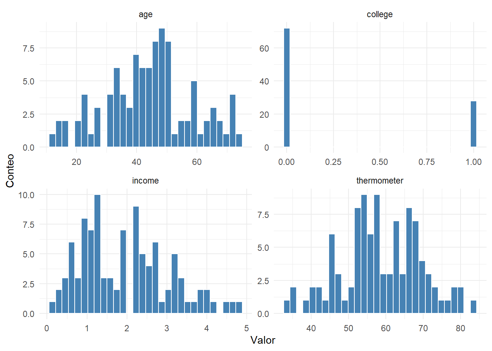
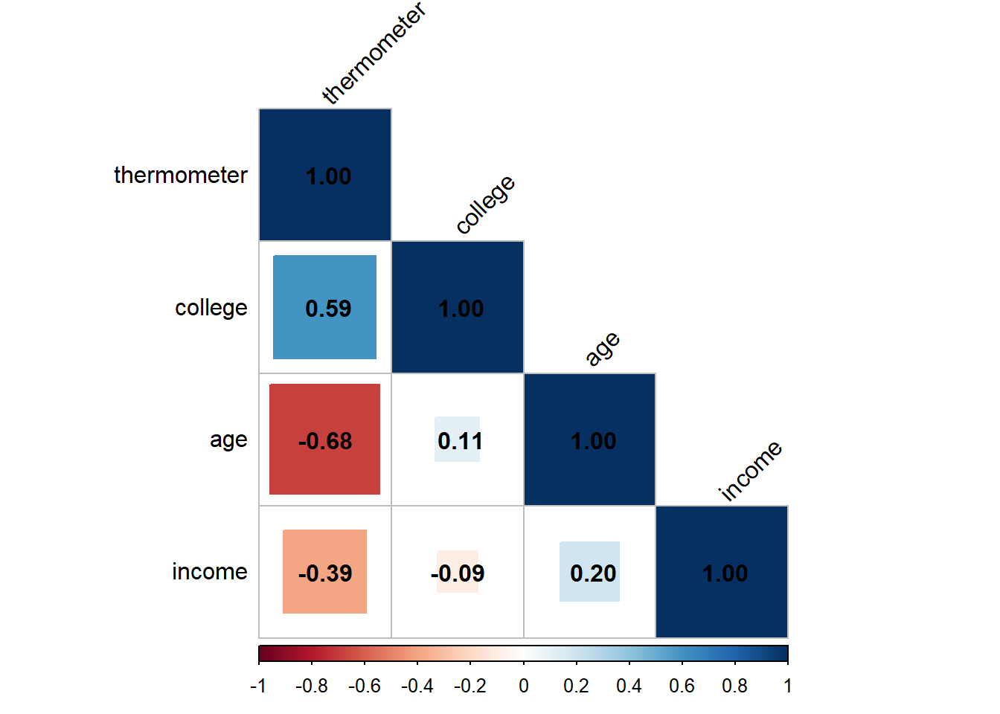
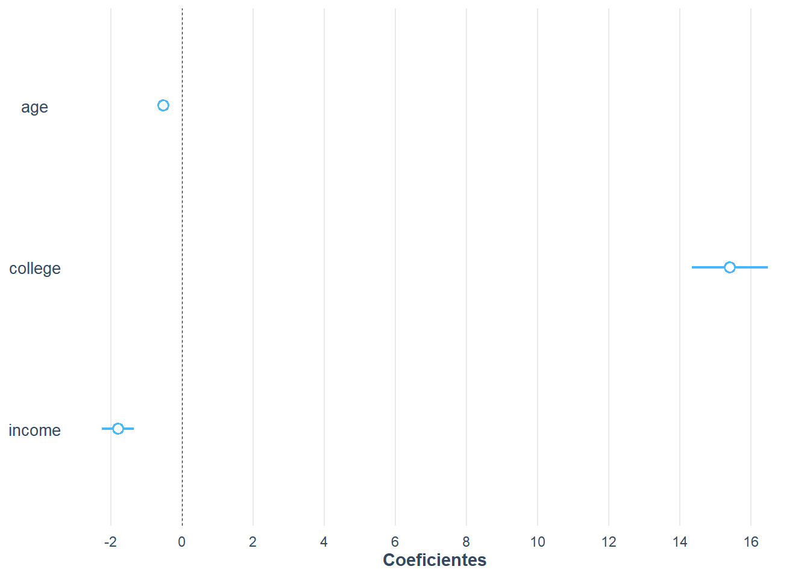
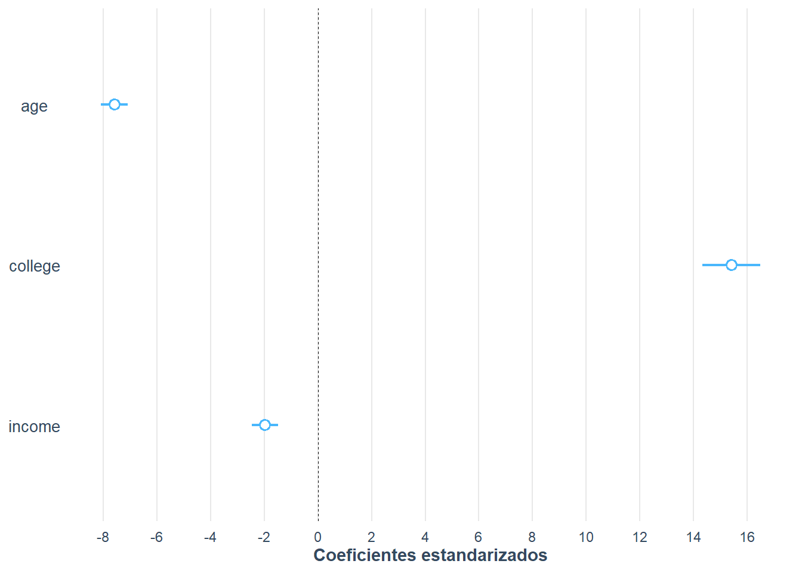
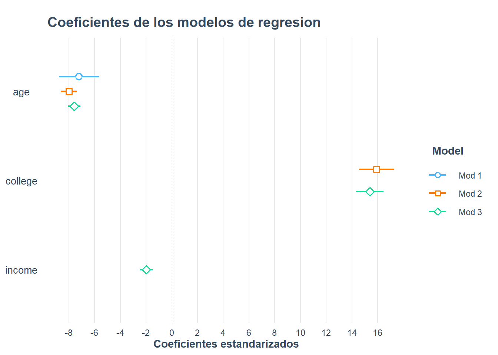
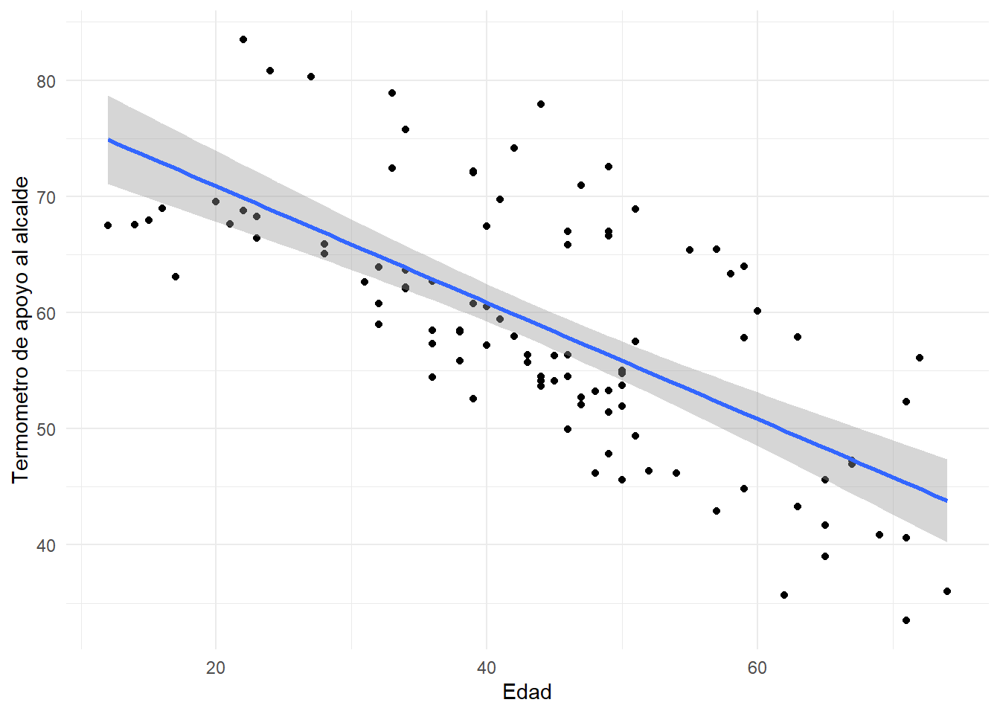

# Regresion desde la simulacion y visualizacion de modelos

En el capitulo 9 estimamos modelos de regresion con datos reales de encuesta. El
problema es que, con datos reales, nunca sabemos **cual es la verdadera relacion**
entre las variables: solo vemos una muestra ruidosa. En este capitulo hacemos un
ejercicio muy didactico que retoma el curso CP-2007 ([@gomez2025]): **jugamos a
ser la Naturaleza**. Nosotros creamos los datos y, por lo tanto, conocemos de
antemano los coeficientes verdaderos. Luego estimamos el modelo con `lm()` y
comprobamos si recupera esos coeficientes. Tambien aprendemos a **visualizar** los
coeficientes de varios modelos con el paquete **jtools**. La referencia base es
Vargas ([@vargas2016]) y [@gujarati2011].

## Crear los datos "como en la naturaleza"

Supongamos que queremos explicar el apoyo de una persona al ejecutivo o alcalde
local. La variable dependiente es un **termometro** de sensacion que va de 0 a 100,
donde valores mas altos indican opiniones mas favorables. Los predictores son:

- `age`: edad, variable continua distribuida normalmente;
- `college`: variable dicotomica (1 si la persona obtuvo un titulo universitario);
- `income`: ingresos en miles de dolares, con un ligero sesgo positivo.


``` r
# Fijamos la semilla para que el ejercicio sea replicable
set.seed(333)

# Edad: normal con media 45 y desviacion estandar 15
age <- as.integer(rnorm(100, 45, 15))

# Universidad: binomial, probabilidad 0,3 de tener titulo
college <- rbinom(100, 1, 0.3)

# Ingresos (miles de dolares): distribucion beta con sesgo positivo
income <- 10 * rbeta(100, 2, 8)

head(data.frame(age, college, income))
  age college    income
1  43       0 2.4427731
2  74       0 3.1663986
3  14       0 3.2047044
4  49       1 1.1211726
5  22       0 0.2223342
6  40       1 2.2907541
```

Ahora especificamos la relacion lineal que, en nuestro universo simulado, genera la
variable dependiente:

$$termometro_i=\alpha+age_i\cdot\beta_1+college_i\cdot\beta_2+income_i\cdot\beta_3+\epsilon_i$$

Como somos la Naturaleza, elegimos los valores de los parametros: intercepto
$\alpha=80$, $\beta_1=-0,5$ (cada ano adicional reduce el apoyo en medio punto),
$\beta_2=15$ (tener titulo universitario aumenta el apoyo en 15 puntos) y
$\beta_3=-2$ (cada mil dolares adicionales reduce el apoyo en 2 puntos). El error
$\epsilon$ se extrae de una normal con media 0 y desviacion estandar 2,5.


``` r
a  <- 80
b1 <- -0.5
b2 <- 15
b3 <- -2
e  <- rnorm(100, 0, 2.5)

# Variable dependiente
thermometer <- a + age * b1 + college * b2 + income * b3 + e

# Base de datos
mayor <- data.frame(thermometer, age, college, income)
head(mayor, 10)
   thermometer age college    income
1     56.34649  43       0 2.4427731
2     35.97210  74       0 3.1663986
3     67.54335  14       0 3.2047044
4     66.99035  49       1 1.1211726
5     68.79006  22       0 0.2223342
6     67.41089  40       1 2.2907541
7     57.89252  63       1 1.9091441
8     46.19084  54       0 3.0704284
9     55.01948  50       0 1.3260681
10    58.45784  36       0 3.3354371
```

El primer paso de cualquier analisis es **explorar los datos**. Veamos el resumen
de todas las variables y su distribucion.


``` r
summary(mayor)
  thermometer         age           college         income      
 Min.   :33.48   Min.   :12.00   Min.   :0.00   Min.   :0.1308  
 1st Qu.:52.65   1st Qu.:35.50   1st Qu.:0.00   1st Qu.:1.1096  
 Median :58.13   Median :45.00   Median :0.00   Median :1.8562  
 Mean   :58.75   Mean   :44.21   Mean   :0.28   Mean   :1.9668  
 3rd Qu.:66.68   3rd Qu.:51.00   3rd Qu.:1.00   3rd Qu.:2.7760  
 Max.   :83.48   Max.   :74.00   Max.   :1.00   Max.   :4.8085  
```

**Figura \@ref(fig:sim-hist) Distribucion de las variables del modelo simulado**

<div class="figure" style="text-align: center">

<p class="caption">(\#fig:sim-hist)Distribucion de la variable dependiente y los predictores simulados</p>
</div>

El termometro se mueve aproximadamente entre 30 y 90; la edad, entre 15 y 80; los
ingresos, entre 0 y 5 (miles de dolares); y cerca de 70 personas no tienen titulo
universitario. Nada raro, como corresponde a datos que nosotros mismos generamos.

## Correlacion como paso previo a la regresion

Antes de estimar el modelo, conviene inspeccionar la **matriz de correlacion**.
Una forma eficiente de hacerlo es con el paquete **corrplot**.


``` r
library(corrplot)

M <- cor(mayor)
round(M, 3)
            thermometer    age college income
thermometer       1.000 -0.681   0.595 -0.391
age              -0.681  1.000   0.111  0.200
college           0.595  0.111   1.000 -0.093
income           -0.391  0.200  -0.093  1.000
```


``` r
corrplot(M, method = "square", type = "lower", order = "hclust",
         tl.col = "black", tl.srt = 45, addCoef.col = TRUE)
```

<div class="figure" style="text-align: center">

<p class="caption">(\#fig:sim-corrplot)Correlograma de las variables del modelo simulado</p>
</div>

Las correlaciones positivas se muestran en azul y las negativas en rojo; el tamano
del cuadrado es proporcional al coeficiente. La primera columna nos dice como se
relaciona el termometro con cada predictor: `age` tiene una correlacion negativa
fuerte (-0,68), `college` una positiva moderada (0,59) y `income` una negativa
debil (-0,39). Estas correlaciones ya anticipan la direccion de los coeficientes.

## Estimar los modelos

La funcion `lm()` estima el modelo lineal. Especificamos la formula como
`respuesta ~ predictor_1 + predictor_2 + ...`. Estimamos tres modelos de
complejidad creciente.


``` r
modelo1 <- lm(thermometer ~ age, data = mayor)
modelo2 <- lm(thermometer ~ age + college, data = mayor)
modelo3 <- lm(thermometer ~ age + college + income, data = mayor)

summary(modelo1)

Call:
lm(formula = thermometer ~ age, data = mayor)

Residuals:
    Min      1Q  Median      3Q     Max 
-14.129  -5.343  -2.420   7.237  19.091 

Coefficients:
            Estimate Std. Error t value Pr(>|t|)    
(Intercept) 80.90042    2.53222  31.948  < 2e-16 ***
age         -0.50107    0.05449  -9.195 6.77e-15 ***
---
Signif. codes:  0 '***' 0.001 '**' 0.01 '*' 0.05 '.' 0.1 ' ' 1

Residual standard error: 7.796 on 98 degrees of freedom
Multiple R-squared:  0.4631,	Adjusted R-squared:  0.4577 
F-statistic: 84.55 on 1 and 98 DF,  p-value: 6.766e-15
```


``` r
summary(modelo2)

Call:
lm(formula = thermometer ~ age + college, data = mayor)

Residuals:
    Min      1Q  Median      3Q     Max 
-8.6889 -1.8682  0.3394  2.1866  7.6208 

Coefficients:
            Estimate Std. Error t value Pr(>|t|)    
(Intercept) 78.88907    1.00068   78.83   <2e-16 ***
age         -0.55637    0.02159  -25.77   <2e-16 ***
college     15.91407    0.68783   23.14   <2e-16 ***
---
Signif. codes:  0 '***' 0.001 '**' 0.01 '*' 0.05 '.' 0.1 ' ' 1

Residual standard error: 3.069 on 97 degrees of freedom
Multiple R-squared:  0.9176,	Adjusted R-squared:  0.9159 
F-statistic: 540.4 on 2 and 97 DF,  p-value: < 2.2e-16
```


``` r
summary(modelo3)

Call:
lm(formula = thermometer ~ age + college + income, data = mayor)

Residuals:
    Min      1Q  Median      3Q     Max 
-5.3957 -1.7177 -0.1198  1.7001  7.4953 

Coefficients:
            Estimate Std. Error t value Pr(>|t|)    
(Intercept) 81.27935    0.83337  97.531  < 2e-16 ***
age         -0.52709    0.01718 -30.678  < 2e-16 ***
college     15.40291    0.53874  28.590  < 2e-16 ***
income      -1.80067    0.22446  -8.022 2.55e-12 ***
---
Signif. codes:  0 '***' 0.001 '**' 0.01 '*' 0.05 '.' 0.1 ' ' 1

Residual standard error: 2.387 on 96 degrees of freedom
Multiple R-squared:  0.9507,	Adjusted R-squared:  0.9492 
F-statistic:   617 on 3 and 96 DF,  p-value: < 2.2e-16
```

Observa que los coeficientes estimados del modelo 3 (`age` = -0,527, `college` =
15,40, `income` = -1,80) son muy cercanos a los coeficientes **verdaderos** que
nosotros fijamos (-0,5, 15 y -2). Esto es exactamente lo que esperabamos: la
regresion recupera la relacion real cuando el modelo esta bien especificado. En
datos reales nunca podemos hacer esta comprobacion, porque no conocemos los
coeficientes verdaderos; la simulacion nos permite ver el mecanismo con claridad.

Ademas, a medida que agregamos predictores, la **R cuadrada** sube (0,46, 0,92 y
0,95) porque cada predictor verdadero aporta a la explicacion de la variable
dependiente. En datos reales, recordar que la R cuadrada **ajustada** penaliza la
inclusion de predictores inutiles.

## Tablas comparadas con jtools

El paquete **jtools** produce tablas mas ordenadas que `summary()` y permite
comparar varios modelos en una sola tabla.


``` r
library(jtools)
export_summs(modelo1, modelo2, modelo3,
             model.names = c("modelo 1", "modelo 2", "modelo 3"),
             statistics = "all")
```


```{=html}
<table class="huxtable" data-quarto-disable-processing="true"  style="margin-left: auto; margin-right: auto;" id="tab:sim-summs">
<caption style="caption-side: top; text-align: center;">(#tab:sim-summs) </caption><col><col><col><col><thead>
<tr>
<th class="huxtable-cell huxtable-header" style="text-align: center;  border-style: solid solid solid solid; border-width: 0.8pt 0pt 0pt 0pt;      font-weight: normal;"></th><th class="huxtable-cell huxtable-header" style="text-align: center;  border-style: solid solid solid solid; border-width: 0.8pt 0pt 0.4pt 0pt;      font-weight: normal;">modelo 1</th><th class="huxtable-cell huxtable-header" style="text-align: center;  border-style: solid solid solid solid; border-width: 0.8pt 0pt 0.4pt 0pt;      font-weight: normal;">modelo 2</th><th class="huxtable-cell huxtable-header" style="text-align: center;  border-style: solid solid solid solid; border-width: 0.8pt 0pt 0.4pt 0pt;      font-weight: normal;">modelo 3</th></tr>
</thead>
<tbody>
<tr>
<th class="huxtable-cell huxtable-header" style="border-style: solid solid solid solid; border-width: 0pt 0pt 0pt 0pt;      font-weight: normal;">(Intercept)</th><td class="huxtable-cell" style="text-align: right;  border-style: solid solid solid solid; border-width: 0.4pt 0pt 0pt 0pt;">80.90 ***</td><td class="huxtable-cell" style="text-align: right;  border-style: solid solid solid solid; border-width: 0.4pt 0pt 0pt 0pt;">78.89 ***</td><td class="huxtable-cell" style="text-align: right;  border-style: solid solid solid solid; border-width: 0.4pt 0pt 0pt 0pt;">81.28 ***</td></tr>
<tr>
<th class="huxtable-cell huxtable-header" style="border-style: solid solid solid solid; border-width: 0pt 0pt 0pt 0pt;      font-weight: normal;"></th><td class="huxtable-cell" style="text-align: right;  border-style: solid solid solid solid; border-width: 0pt 0pt 0pt 0pt;">(2.53)&nbsp;&nbsp;&nbsp;</td><td class="huxtable-cell" style="text-align: right;  border-style: solid solid solid solid; border-width: 0pt 0pt 0pt 0pt;">(1.00)&nbsp;&nbsp;&nbsp;</td><td class="huxtable-cell" style="text-align: right;  border-style: solid solid solid solid; border-width: 0pt 0pt 0pt 0pt;">(0.83)&nbsp;&nbsp;&nbsp;</td></tr>
<tr>
<th class="huxtable-cell huxtable-header" style="border-style: solid solid solid solid; border-width: 0pt 0pt 0pt 0pt;      font-weight: normal;">age</th><td class="huxtable-cell" style="text-align: right;  border-style: solid solid solid solid; border-width: 0pt 0pt 0pt 0pt;">-0.50 ***</td><td class="huxtable-cell" style="text-align: right;  border-style: solid solid solid solid; border-width: 0pt 0pt 0pt 0pt;">-0.56 ***</td><td class="huxtable-cell" style="text-align: right;  border-style: solid solid solid solid; border-width: 0pt 0pt 0pt 0pt;">-0.53 ***</td></tr>
<tr>
<th class="huxtable-cell huxtable-header" style="border-style: solid solid solid solid; border-width: 0pt 0pt 0pt 0pt;      font-weight: normal;"></th><td class="huxtable-cell" style="text-align: right;  border-style: solid solid solid solid; border-width: 0pt 0pt 0pt 0pt;">(0.05)&nbsp;&nbsp;&nbsp;</td><td class="huxtable-cell" style="text-align: right;  border-style: solid solid solid solid; border-width: 0pt 0pt 0pt 0pt;">(0.02)&nbsp;&nbsp;&nbsp;</td><td class="huxtable-cell" style="text-align: right;  border-style: solid solid solid solid; border-width: 0pt 0pt 0pt 0pt;">(0.02)&nbsp;&nbsp;&nbsp;</td></tr>
<tr>
<th class="huxtable-cell huxtable-header" style="border-style: solid solid solid solid; border-width: 0pt 0pt 0pt 0pt;      font-weight: normal;">college</th><td class="huxtable-cell" style="text-align: right;  border-style: solid solid solid solid; border-width: 0pt 0pt 0pt 0pt;">&nbsp;&nbsp;&nbsp;&nbsp;&nbsp;&nbsp;&nbsp;</td><td class="huxtable-cell" style="text-align: right;  border-style: solid solid solid solid; border-width: 0pt 0pt 0pt 0pt;">15.91 ***</td><td class="huxtable-cell" style="text-align: right;  border-style: solid solid solid solid; border-width: 0pt 0pt 0pt 0pt;">15.40 ***</td></tr>
<tr>
<th class="huxtable-cell huxtable-header" style="border-style: solid solid solid solid; border-width: 0pt 0pt 0pt 0pt;      font-weight: normal;"></th><td class="huxtable-cell" style="text-align: right;  border-style: solid solid solid solid; border-width: 0pt 0pt 0pt 0pt;">&nbsp;&nbsp;&nbsp;&nbsp;&nbsp;&nbsp;&nbsp;</td><td class="huxtable-cell" style="text-align: right;  border-style: solid solid solid solid; border-width: 0pt 0pt 0pt 0pt;">(0.69)&nbsp;&nbsp;&nbsp;</td><td class="huxtable-cell" style="text-align: right;  border-style: solid solid solid solid; border-width: 0pt 0pt 0pt 0pt;">(0.54)&nbsp;&nbsp;&nbsp;</td></tr>
<tr>
<th class="huxtable-cell huxtable-header" style="border-style: solid solid solid solid; border-width: 0pt 0pt 0pt 0pt;      font-weight: normal;">income</th><td class="huxtable-cell" style="text-align: right;  border-style: solid solid solid solid; border-width: 0pt 0pt 0pt 0pt;">&nbsp;&nbsp;&nbsp;&nbsp;&nbsp;&nbsp;&nbsp;</td><td class="huxtable-cell" style="text-align: right;  border-style: solid solid solid solid; border-width: 0pt 0pt 0pt 0pt;">&nbsp;&nbsp;&nbsp;&nbsp;&nbsp;&nbsp;&nbsp;</td><td class="huxtable-cell" style="text-align: right;  border-style: solid solid solid solid; border-width: 0pt 0pt 0pt 0pt;">-1.80 ***</td></tr>
<tr>
<th class="huxtable-cell huxtable-header" style="border-style: solid solid solid solid; border-width: 0pt 0pt 0pt 0pt;      font-weight: normal;"></th><td class="huxtable-cell" style="text-align: right;  border-style: solid solid solid solid; border-width: 0pt 0pt 0.4pt 0pt;">&nbsp;&nbsp;&nbsp;&nbsp;&nbsp;&nbsp;&nbsp;</td><td class="huxtable-cell" style="text-align: right;  border-style: solid solid solid solid; border-width: 0pt 0pt 0.4pt 0pt;">&nbsp;&nbsp;&nbsp;&nbsp;&nbsp;&nbsp;&nbsp;</td><td class="huxtable-cell" style="text-align: right;  border-style: solid solid solid solid; border-width: 0pt 0pt 0.4pt 0pt;">(0.22)&nbsp;&nbsp;&nbsp;</td></tr>
<tr>
<th class="huxtable-cell huxtable-header" style="border-style: solid solid solid solid; border-width: 0pt 0pt 0pt 0pt;      font-weight: normal;">nobs</th><td class="huxtable-cell" style="text-align: right;  border-style: solid solid solid solid; border-width: 0.4pt 0pt 0pt 0pt;">100&nbsp;&nbsp;&nbsp;&nbsp;&nbsp;&nbsp;&nbsp;</td><td class="huxtable-cell" style="text-align: right;  border-style: solid solid solid solid; border-width: 0.4pt 0pt 0pt 0pt;">100&nbsp;&nbsp;&nbsp;&nbsp;&nbsp;&nbsp;&nbsp;</td><td class="huxtable-cell" style="text-align: right;  border-style: solid solid solid solid; border-width: 0.4pt 0pt 0pt 0pt;">100&nbsp;&nbsp;&nbsp;&nbsp;&nbsp;&nbsp;&nbsp;</td></tr>
<tr>
<th class="huxtable-cell huxtable-header" style="border-style: solid solid solid solid; border-width: 0pt 0pt 0pt 0pt;      font-weight: normal;">r.squared</th><td class="huxtable-cell" style="text-align: right;  border-style: solid solid solid solid; border-width: 0pt 0pt 0pt 0pt;">0.46&nbsp;&nbsp;&nbsp;&nbsp;</td><td class="huxtable-cell" style="text-align: right;  border-style: solid solid solid solid; border-width: 0pt 0pt 0pt 0pt;">0.92&nbsp;&nbsp;&nbsp;&nbsp;</td><td class="huxtable-cell" style="text-align: right;  border-style: solid solid solid solid; border-width: 0pt 0pt 0pt 0pt;">0.95&nbsp;&nbsp;&nbsp;&nbsp;</td></tr>
<tr>
<th class="huxtable-cell huxtable-header" style="border-style: solid solid solid solid; border-width: 0pt 0pt 0pt 0pt;      font-weight: normal;">adj.r.squared</th><td class="huxtable-cell" style="text-align: right;  border-style: solid solid solid solid; border-width: 0pt 0pt 0pt 0pt;">0.46&nbsp;&nbsp;&nbsp;&nbsp;</td><td class="huxtable-cell" style="text-align: right;  border-style: solid solid solid solid; border-width: 0pt 0pt 0pt 0pt;">0.92&nbsp;&nbsp;&nbsp;&nbsp;</td><td class="huxtable-cell" style="text-align: right;  border-style: solid solid solid solid; border-width: 0pt 0pt 0pt 0pt;">0.95&nbsp;&nbsp;&nbsp;&nbsp;</td></tr>
<tr>
<th class="huxtable-cell huxtable-header" style="border-style: solid solid solid solid; border-width: 0pt 0pt 0pt 0pt;      font-weight: normal;">sigma</th><td class="huxtable-cell" style="text-align: right;  border-style: solid solid solid solid; border-width: 0pt 0pt 0pt 0pt;">7.80&nbsp;&nbsp;&nbsp;&nbsp;</td><td class="huxtable-cell" style="text-align: right;  border-style: solid solid solid solid; border-width: 0pt 0pt 0pt 0pt;">3.07&nbsp;&nbsp;&nbsp;&nbsp;</td><td class="huxtable-cell" style="text-align: right;  border-style: solid solid solid solid; border-width: 0pt 0pt 0pt 0pt;">2.39&nbsp;&nbsp;&nbsp;&nbsp;</td></tr>
<tr>
<th class="huxtable-cell huxtable-header" style="border-style: solid solid solid solid; border-width: 0pt 0pt 0pt 0pt;      font-weight: normal;">statistic</th><td class="huxtable-cell" style="text-align: right;  border-style: solid solid solid solid; border-width: 0pt 0pt 0pt 0pt;">84.55&nbsp;&nbsp;&nbsp;&nbsp;</td><td class="huxtable-cell" style="text-align: right;  border-style: solid solid solid solid; border-width: 0pt 0pt 0pt 0pt;">540.40&nbsp;&nbsp;&nbsp;&nbsp;</td><td class="huxtable-cell" style="text-align: right;  border-style: solid solid solid solid; border-width: 0pt 0pt 0pt 0pt;">617.03&nbsp;&nbsp;&nbsp;&nbsp;</td></tr>
<tr>
<th class="huxtable-cell huxtable-header" style="border-style: solid solid solid solid; border-width: 0pt 0pt 0pt 0pt;      font-weight: normal;">p.value</th><td class="huxtable-cell" style="text-align: right;  border-style: solid solid solid solid; border-width: 0pt 0pt 0pt 0pt;">0.00&nbsp;&nbsp;&nbsp;&nbsp;</td><td class="huxtable-cell" style="text-align: right;  border-style: solid solid solid solid; border-width: 0pt 0pt 0pt 0pt;">0.00&nbsp;&nbsp;&nbsp;&nbsp;</td><td class="huxtable-cell" style="text-align: right;  border-style: solid solid solid solid; border-width: 0pt 0pt 0pt 0pt;">0.00&nbsp;&nbsp;&nbsp;&nbsp;</td></tr>
<tr>
<th class="huxtable-cell huxtable-header" style="border-style: solid solid solid solid; border-width: 0pt 0pt 0pt 0pt;      font-weight: normal;">df</th><td class="huxtable-cell" style="text-align: right;  border-style: solid solid solid solid; border-width: 0pt 0pt 0pt 0pt;">1.00&nbsp;&nbsp;&nbsp;&nbsp;</td><td class="huxtable-cell" style="text-align: right;  border-style: solid solid solid solid; border-width: 0pt 0pt 0pt 0pt;">2.00&nbsp;&nbsp;&nbsp;&nbsp;</td><td class="huxtable-cell" style="text-align: right;  border-style: solid solid solid solid; border-width: 0pt 0pt 0pt 0pt;">3.00&nbsp;&nbsp;&nbsp;&nbsp;</td></tr>
<tr>
<th class="huxtable-cell huxtable-header" style="border-style: solid solid solid solid; border-width: 0pt 0pt 0pt 0pt;      font-weight: normal;">logLik</th><td class="huxtable-cell" style="text-align: right;  border-style: solid solid solid solid; border-width: 0pt 0pt 0pt 0pt;">-346.25&nbsp;&nbsp;&nbsp;&nbsp;</td><td class="huxtable-cell" style="text-align: right;  border-style: solid solid solid solid; border-width: 0pt 0pt 0pt 0pt;">-252.52&nbsp;&nbsp;&nbsp;&nbsp;</td><td class="huxtable-cell" style="text-align: right;  border-style: solid solid solid solid; border-width: 0pt 0pt 0pt 0pt;">-226.87&nbsp;&nbsp;&nbsp;&nbsp;</td></tr>
<tr>
<th class="huxtable-cell huxtable-header" style="border-style: solid solid solid solid; border-width: 0pt 0pt 0pt 0pt;      font-weight: normal;">AIC</th><td class="huxtable-cell" style="text-align: right;  border-style: solid solid solid solid; border-width: 0pt 0pt 0pt 0pt;">698.50&nbsp;&nbsp;&nbsp;&nbsp;</td><td class="huxtable-cell" style="text-align: right;  border-style: solid solid solid solid; border-width: 0pt 0pt 0pt 0pt;">513.04&nbsp;&nbsp;&nbsp;&nbsp;</td><td class="huxtable-cell" style="text-align: right;  border-style: solid solid solid solid; border-width: 0pt 0pt 0pt 0pt;">463.73&nbsp;&nbsp;&nbsp;&nbsp;</td></tr>
<tr>
<th class="huxtable-cell huxtable-header" style="border-style: solid solid solid solid; border-width: 0pt 0pt 0pt 0pt;      font-weight: normal;">BIC</th><td class="huxtable-cell" style="text-align: right;  border-style: solid solid solid solid; border-width: 0pt 0pt 0pt 0pt;">706.32&nbsp;&nbsp;&nbsp;&nbsp;</td><td class="huxtable-cell" style="text-align: right;  border-style: solid solid solid solid; border-width: 0pt 0pt 0pt 0pt;">523.46&nbsp;&nbsp;&nbsp;&nbsp;</td><td class="huxtable-cell" style="text-align: right;  border-style: solid solid solid solid; border-width: 0pt 0pt 0pt 0pt;">476.76&nbsp;&nbsp;&nbsp;&nbsp;</td></tr>
<tr>
<th class="huxtable-cell huxtable-header" style="border-style: solid solid solid solid; border-width: 0pt 0pt 0pt 0pt;      font-weight: normal;">deviance</th><td class="huxtable-cell" style="text-align: right;  border-style: solid solid solid solid; border-width: 0pt 0pt 0pt 0pt;">5956.92&nbsp;&nbsp;&nbsp;&nbsp;</td><td class="huxtable-cell" style="text-align: right;  border-style: solid solid solid solid; border-width: 0pt 0pt 0pt 0pt;">913.83&nbsp;&nbsp;&nbsp;&nbsp;</td><td class="huxtable-cell" style="text-align: right;  border-style: solid solid solid solid; border-width: 0pt 0pt 0pt 0pt;">547.08&nbsp;&nbsp;&nbsp;&nbsp;</td></tr>
<tr>
<th class="huxtable-cell huxtable-header" style="border-style: solid solid solid solid; border-width: 0pt 0pt 0pt 0pt;      font-weight: normal;">df.residual</th><td class="huxtable-cell" style="text-align: right;  border-style: solid solid solid solid; border-width: 0pt 0pt 0pt 0pt;">98.00&nbsp;&nbsp;&nbsp;&nbsp;</td><td class="huxtable-cell" style="text-align: right;  border-style: solid solid solid solid; border-width: 0pt 0pt 0pt 0pt;">97.00&nbsp;&nbsp;&nbsp;&nbsp;</td><td class="huxtable-cell" style="text-align: right;  border-style: solid solid solid solid; border-width: 0pt 0pt 0pt 0pt;">96.00&nbsp;&nbsp;&nbsp;&nbsp;</td></tr>
<tr>
<th class="huxtable-cell huxtable-header" style="border-style: solid solid solid solid; border-width: 0pt 0pt 0.8pt 0pt;      font-weight: normal;">nobs.1</th><td class="huxtable-cell" style="text-align: right;  border-style: solid solid solid solid; border-width: 0pt 0pt 0.8pt 0pt;">100.00&nbsp;&nbsp;&nbsp;&nbsp;</td><td class="huxtable-cell" style="text-align: right;  border-style: solid solid solid solid; border-width: 0pt 0pt 0.8pt 0pt;">100.00&nbsp;&nbsp;&nbsp;&nbsp;</td><td class="huxtable-cell" style="text-align: right;  border-style: solid solid solid solid; border-width: 0pt 0pt 0.8pt 0pt;">100.00&nbsp;&nbsp;&nbsp;&nbsp;</td></tr>
<tr>
<th class="huxtable-cell huxtable-header" colspan="4" style="border-style: solid solid solid solid; border-width: 0.8pt 0pt 0pt 0pt;      font-weight: normal;">*** p &lt; 0.001; ** p &lt; 0.01; * p &lt; 0.05.</th></tr>
</tbody>
</table>

```


La tabla resume los tres modelos. Para interpretarla:

- las **estrellas** marcan los predictores estadisticamente significativos;
- el **signo** del coeficiente indica la direccion de la relacion;
- `r.squared` y `adj.r.squared` indican que tan bien se ajusta el modelo; con
  varios predictores conviene mirar la R cuadrada **ajustada**.

### Coeficientes estandarizados

Como los predictores estan en unidades distintas (anos, 0/1, miles de dolares), no
podemos comparar directamente el tamano de los coeficientes. Con
`scale = TRUE`, jtools estandariza los coeficientes a unidades de desviacion
estandar, lo que permite ordenarlos por importancia.


``` r
export_summs(modelo1, modelo2, modelo3,
             model.names = c("modelo 1", "modelo 2", "modelo 3"),
             scale = TRUE, statistics = "all")
```


```{=html}
<table class="huxtable" data-quarto-disable-processing="true"  style="margin-left: auto; margin-right: auto;" id="tab:sim-summs-scale">
<caption style="caption-side: top; text-align: center;">(#tab:sim-summs-scale) </caption><col><col><col><col><thead>
<tr>
<th class="huxtable-cell huxtable-header" style="text-align: center;  border-style: solid solid solid solid; border-width: 0.8pt 0pt 0pt 0pt;      font-weight: normal;"></th><th class="huxtable-cell huxtable-header" style="text-align: center;  border-style: solid solid solid solid; border-width: 0.8pt 0pt 0.4pt 0pt;      font-weight: normal;">modelo 1</th><th class="huxtable-cell huxtable-header" style="text-align: center;  border-style: solid solid solid solid; border-width: 0.8pt 0pt 0.4pt 0pt;      font-weight: normal;">modelo 2</th><th class="huxtable-cell huxtable-header" style="text-align: center;  border-style: solid solid solid solid; border-width: 0.8pt 0pt 0.4pt 0pt;      font-weight: normal;">modelo 3</th></tr>
</thead>
<tbody>
<tr>
<th class="huxtable-cell huxtable-header" style="border-style: solid solid solid solid; border-width: 0pt 0pt 0pt 0pt;      font-weight: normal;">(Intercept)</th><td class="huxtable-cell" style="text-align: right;  border-style: solid solid solid solid; border-width: 0.4pt 0pt 0pt 0pt;">58.75 ***</td><td class="huxtable-cell" style="text-align: right;  border-style: solid solid solid solid; border-width: 0.4pt 0pt 0pt 0pt;">54.29 ***</td><td class="huxtable-cell" style="text-align: right;  border-style: solid solid solid solid; border-width: 0.4pt 0pt 0pt 0pt;">54.44 ***</td></tr>
<tr>
<th class="huxtable-cell huxtable-header" style="border-style: solid solid solid solid; border-width: 0pt 0pt 0pt 0pt;      font-weight: normal;"></th><td class="huxtable-cell" style="text-align: right;  border-style: solid solid solid solid; border-width: 0pt 0pt 0pt 0pt;">(0.78)&nbsp;&nbsp;&nbsp;</td><td class="huxtable-cell" style="text-align: right;  border-style: solid solid solid solid; border-width: 0pt 0pt 0pt 0pt;">(0.36)&nbsp;&nbsp;&nbsp;</td><td class="huxtable-cell" style="text-align: right;  border-style: solid solid solid solid; border-width: 0pt 0pt 0pt 0pt;">(0.28)&nbsp;&nbsp;&nbsp;</td></tr>
<tr>
<th class="huxtable-cell huxtable-header" style="border-style: solid solid solid solid; border-width: 0pt 0pt 0pt 0pt;      font-weight: normal;">age</th><td class="huxtable-cell" style="text-align: right;  border-style: solid solid solid solid; border-width: 0pt 0pt 0pt 0pt;">-7.20 ***</td><td class="huxtable-cell" style="text-align: right;  border-style: solid solid solid solid; border-width: 0pt 0pt 0pt 0pt;">-8.00 ***</td><td class="huxtable-cell" style="text-align: right;  border-style: solid solid solid solid; border-width: 0pt 0pt 0pt 0pt;">-7.58 ***</td></tr>
<tr>
<th class="huxtable-cell huxtable-header" style="border-style: solid solid solid solid; border-width: 0pt 0pt 0pt 0pt;      font-weight: normal;"></th><td class="huxtable-cell" style="text-align: right;  border-style: solid solid solid solid; border-width: 0pt 0pt 0pt 0pt;">(0.78)&nbsp;&nbsp;&nbsp;</td><td class="huxtable-cell" style="text-align: right;  border-style: solid solid solid solid; border-width: 0pt 0pt 0pt 0pt;">(0.31)&nbsp;&nbsp;&nbsp;</td><td class="huxtable-cell" style="text-align: right;  border-style: solid solid solid solid; border-width: 0pt 0pt 0pt 0pt;">(0.25)&nbsp;&nbsp;&nbsp;</td></tr>
<tr>
<th class="huxtable-cell huxtable-header" style="border-style: solid solid solid solid; border-width: 0pt 0pt 0pt 0pt;      font-weight: normal;">college</th><td class="huxtable-cell" style="text-align: right;  border-style: solid solid solid solid; border-width: 0pt 0pt 0pt 0pt;">&nbsp;&nbsp;&nbsp;&nbsp;&nbsp;&nbsp;&nbsp;</td><td class="huxtable-cell" style="text-align: right;  border-style: solid solid solid solid; border-width: 0pt 0pt 0pt 0pt;">15.91 ***</td><td class="huxtable-cell" style="text-align: right;  border-style: solid solid solid solid; border-width: 0pt 0pt 0pt 0pt;">15.40 ***</td></tr>
<tr>
<th class="huxtable-cell huxtable-header" style="border-style: solid solid solid solid; border-width: 0pt 0pt 0pt 0pt;      font-weight: normal;"></th><td class="huxtable-cell" style="text-align: right;  border-style: solid solid solid solid; border-width: 0pt 0pt 0pt 0pt;">&nbsp;&nbsp;&nbsp;&nbsp;&nbsp;&nbsp;&nbsp;</td><td class="huxtable-cell" style="text-align: right;  border-style: solid solid solid solid; border-width: 0pt 0pt 0pt 0pt;">(0.69)&nbsp;&nbsp;&nbsp;</td><td class="huxtable-cell" style="text-align: right;  border-style: solid solid solid solid; border-width: 0pt 0pt 0pt 0pt;">(0.54)&nbsp;&nbsp;&nbsp;</td></tr>
<tr>
<th class="huxtable-cell huxtable-header" style="border-style: solid solid solid solid; border-width: 0pt 0pt 0pt 0pt;      font-weight: normal;">income</th><td class="huxtable-cell" style="text-align: right;  border-style: solid solid solid solid; border-width: 0pt 0pt 0pt 0pt;">&nbsp;&nbsp;&nbsp;&nbsp;&nbsp;&nbsp;&nbsp;</td><td class="huxtable-cell" style="text-align: right;  border-style: solid solid solid solid; border-width: 0pt 0pt 0pt 0pt;">&nbsp;&nbsp;&nbsp;&nbsp;&nbsp;&nbsp;&nbsp;</td><td class="huxtable-cell" style="text-align: right;  border-style: solid solid solid solid; border-width: 0pt 0pt 0pt 0pt;">-1.98 ***</td></tr>
<tr>
<th class="huxtable-cell huxtable-header" style="border-style: solid solid solid solid; border-width: 0pt 0pt 0pt 0pt;      font-weight: normal;"></th><td class="huxtable-cell" style="text-align: right;  border-style: solid solid solid solid; border-width: 0pt 0pt 0.4pt 0pt;">&nbsp;&nbsp;&nbsp;&nbsp;&nbsp;&nbsp;&nbsp;</td><td class="huxtable-cell" style="text-align: right;  border-style: solid solid solid solid; border-width: 0pt 0pt 0.4pt 0pt;">&nbsp;&nbsp;&nbsp;&nbsp;&nbsp;&nbsp;&nbsp;</td><td class="huxtable-cell" style="text-align: right;  border-style: solid solid solid solid; border-width: 0pt 0pt 0.4pt 0pt;">(0.25)&nbsp;&nbsp;&nbsp;</td></tr>
<tr>
<th class="huxtable-cell huxtable-header" style="border-style: solid solid solid solid; border-width: 0pt 0pt 0pt 0pt;      font-weight: normal;">nobs</th><td class="huxtable-cell" style="text-align: right;  border-style: solid solid solid solid; border-width: 0.4pt 0pt 0pt 0pt;">100&nbsp;&nbsp;&nbsp;&nbsp;&nbsp;&nbsp;&nbsp;</td><td class="huxtable-cell" style="text-align: right;  border-style: solid solid solid solid; border-width: 0.4pt 0pt 0pt 0pt;">100&nbsp;&nbsp;&nbsp;&nbsp;&nbsp;&nbsp;&nbsp;</td><td class="huxtable-cell" style="text-align: right;  border-style: solid solid solid solid; border-width: 0.4pt 0pt 0pt 0pt;">100&nbsp;&nbsp;&nbsp;&nbsp;&nbsp;&nbsp;&nbsp;</td></tr>
<tr>
<th class="huxtable-cell huxtable-header" style="border-style: solid solid solid solid; border-width: 0pt 0pt 0pt 0pt;      font-weight: normal;">r.squared</th><td class="huxtable-cell" style="text-align: right;  border-style: solid solid solid solid; border-width: 0pt 0pt 0pt 0pt;">0.46&nbsp;&nbsp;&nbsp;&nbsp;</td><td class="huxtable-cell" style="text-align: right;  border-style: solid solid solid solid; border-width: 0pt 0pt 0pt 0pt;">0.92&nbsp;&nbsp;&nbsp;&nbsp;</td><td class="huxtable-cell" style="text-align: right;  border-style: solid solid solid solid; border-width: 0pt 0pt 0pt 0pt;">0.95&nbsp;&nbsp;&nbsp;&nbsp;</td></tr>
<tr>
<th class="huxtable-cell huxtable-header" style="border-style: solid solid solid solid; border-width: 0pt 0pt 0pt 0pt;      font-weight: normal;">adj.r.squared</th><td class="huxtable-cell" style="text-align: right;  border-style: solid solid solid solid; border-width: 0pt 0pt 0pt 0pt;">0.46&nbsp;&nbsp;&nbsp;&nbsp;</td><td class="huxtable-cell" style="text-align: right;  border-style: solid solid solid solid; border-width: 0pt 0pt 0pt 0pt;">0.92&nbsp;&nbsp;&nbsp;&nbsp;</td><td class="huxtable-cell" style="text-align: right;  border-style: solid solid solid solid; border-width: 0pt 0pt 0pt 0pt;">0.95&nbsp;&nbsp;&nbsp;&nbsp;</td></tr>
<tr>
<th class="huxtable-cell huxtable-header" style="border-style: solid solid solid solid; border-width: 0pt 0pt 0pt 0pt;      font-weight: normal;">sigma</th><td class="huxtable-cell" style="text-align: right;  border-style: solid solid solid solid; border-width: 0pt 0pt 0pt 0pt;">7.80&nbsp;&nbsp;&nbsp;&nbsp;</td><td class="huxtable-cell" style="text-align: right;  border-style: solid solid solid solid; border-width: 0pt 0pt 0pt 0pt;">3.07&nbsp;&nbsp;&nbsp;&nbsp;</td><td class="huxtable-cell" style="text-align: right;  border-style: solid solid solid solid; border-width: 0pt 0pt 0pt 0pt;">2.39&nbsp;&nbsp;&nbsp;&nbsp;</td></tr>
<tr>
<th class="huxtable-cell huxtable-header" style="border-style: solid solid solid solid; border-width: 0pt 0pt 0pt 0pt;      font-weight: normal;">statistic</th><td class="huxtable-cell" style="text-align: right;  border-style: solid solid solid solid; border-width: 0pt 0pt 0pt 0pt;">84.55&nbsp;&nbsp;&nbsp;&nbsp;</td><td class="huxtable-cell" style="text-align: right;  border-style: solid solid solid solid; border-width: 0pt 0pt 0pt 0pt;">540.40&nbsp;&nbsp;&nbsp;&nbsp;</td><td class="huxtable-cell" style="text-align: right;  border-style: solid solid solid solid; border-width: 0pt 0pt 0pt 0pt;">617.03&nbsp;&nbsp;&nbsp;&nbsp;</td></tr>
<tr>
<th class="huxtable-cell huxtable-header" style="border-style: solid solid solid solid; border-width: 0pt 0pt 0pt 0pt;      font-weight: normal;">p.value</th><td class="huxtable-cell" style="text-align: right;  border-style: solid solid solid solid; border-width: 0pt 0pt 0pt 0pt;">0.00&nbsp;&nbsp;&nbsp;&nbsp;</td><td class="huxtable-cell" style="text-align: right;  border-style: solid solid solid solid; border-width: 0pt 0pt 0pt 0pt;">0.00&nbsp;&nbsp;&nbsp;&nbsp;</td><td class="huxtable-cell" style="text-align: right;  border-style: solid solid solid solid; border-width: 0pt 0pt 0pt 0pt;">0.00&nbsp;&nbsp;&nbsp;&nbsp;</td></tr>
<tr>
<th class="huxtable-cell huxtable-header" style="border-style: solid solid solid solid; border-width: 0pt 0pt 0pt 0pt;      font-weight: normal;">df</th><td class="huxtable-cell" style="text-align: right;  border-style: solid solid solid solid; border-width: 0pt 0pt 0pt 0pt;">1.00&nbsp;&nbsp;&nbsp;&nbsp;</td><td class="huxtable-cell" style="text-align: right;  border-style: solid solid solid solid; border-width: 0pt 0pt 0pt 0pt;">2.00&nbsp;&nbsp;&nbsp;&nbsp;</td><td class="huxtable-cell" style="text-align: right;  border-style: solid solid solid solid; border-width: 0pt 0pt 0pt 0pt;">3.00&nbsp;&nbsp;&nbsp;&nbsp;</td></tr>
<tr>
<th class="huxtable-cell huxtable-header" style="border-style: solid solid solid solid; border-width: 0pt 0pt 0pt 0pt;      font-weight: normal;">logLik</th><td class="huxtable-cell" style="text-align: right;  border-style: solid solid solid solid; border-width: 0pt 0pt 0pt 0pt;">-346.25&nbsp;&nbsp;&nbsp;&nbsp;</td><td class="huxtable-cell" style="text-align: right;  border-style: solid solid solid solid; border-width: 0pt 0pt 0pt 0pt;">-252.52&nbsp;&nbsp;&nbsp;&nbsp;</td><td class="huxtable-cell" style="text-align: right;  border-style: solid solid solid solid; border-width: 0pt 0pt 0pt 0pt;">-226.87&nbsp;&nbsp;&nbsp;&nbsp;</td></tr>
<tr>
<th class="huxtable-cell huxtable-header" style="border-style: solid solid solid solid; border-width: 0pt 0pt 0pt 0pt;      font-weight: normal;">AIC</th><td class="huxtable-cell" style="text-align: right;  border-style: solid solid solid solid; border-width: 0pt 0pt 0pt 0pt;">698.50&nbsp;&nbsp;&nbsp;&nbsp;</td><td class="huxtable-cell" style="text-align: right;  border-style: solid solid solid solid; border-width: 0pt 0pt 0pt 0pt;">513.04&nbsp;&nbsp;&nbsp;&nbsp;</td><td class="huxtable-cell" style="text-align: right;  border-style: solid solid solid solid; border-width: 0pt 0pt 0pt 0pt;">463.73&nbsp;&nbsp;&nbsp;&nbsp;</td></tr>
<tr>
<th class="huxtable-cell huxtable-header" style="border-style: solid solid solid solid; border-width: 0pt 0pt 0pt 0pt;      font-weight: normal;">BIC</th><td class="huxtable-cell" style="text-align: right;  border-style: solid solid solid solid; border-width: 0pt 0pt 0pt 0pt;">706.32&nbsp;&nbsp;&nbsp;&nbsp;</td><td class="huxtable-cell" style="text-align: right;  border-style: solid solid solid solid; border-width: 0pt 0pt 0pt 0pt;">523.46&nbsp;&nbsp;&nbsp;&nbsp;</td><td class="huxtable-cell" style="text-align: right;  border-style: solid solid solid solid; border-width: 0pt 0pt 0pt 0pt;">476.76&nbsp;&nbsp;&nbsp;&nbsp;</td></tr>
<tr>
<th class="huxtable-cell huxtable-header" style="border-style: solid solid solid solid; border-width: 0pt 0pt 0pt 0pt;      font-weight: normal;">deviance</th><td class="huxtable-cell" style="text-align: right;  border-style: solid solid solid solid; border-width: 0pt 0pt 0pt 0pt;">5956.92&nbsp;&nbsp;&nbsp;&nbsp;</td><td class="huxtable-cell" style="text-align: right;  border-style: solid solid solid solid; border-width: 0pt 0pt 0pt 0pt;">913.83&nbsp;&nbsp;&nbsp;&nbsp;</td><td class="huxtable-cell" style="text-align: right;  border-style: solid solid solid solid; border-width: 0pt 0pt 0pt 0pt;">547.08&nbsp;&nbsp;&nbsp;&nbsp;</td></tr>
<tr>
<th class="huxtable-cell huxtable-header" style="border-style: solid solid solid solid; border-width: 0pt 0pt 0pt 0pt;      font-weight: normal;">df.residual</th><td class="huxtable-cell" style="text-align: right;  border-style: solid solid solid solid; border-width: 0pt 0pt 0pt 0pt;">98.00&nbsp;&nbsp;&nbsp;&nbsp;</td><td class="huxtable-cell" style="text-align: right;  border-style: solid solid solid solid; border-width: 0pt 0pt 0pt 0pt;">97.00&nbsp;&nbsp;&nbsp;&nbsp;</td><td class="huxtable-cell" style="text-align: right;  border-style: solid solid solid solid; border-width: 0pt 0pt 0pt 0pt;">96.00&nbsp;&nbsp;&nbsp;&nbsp;</td></tr>
<tr>
<th class="huxtable-cell huxtable-header" style="border-style: solid solid solid solid; border-width: 0pt 0pt 0.8pt 0pt;      font-weight: normal;">nobs.1</th><td class="huxtable-cell" style="text-align: right;  border-style: solid solid solid solid; border-width: 0pt 0pt 0.8pt 0pt;">100.00&nbsp;&nbsp;&nbsp;&nbsp;</td><td class="huxtable-cell" style="text-align: right;  border-style: solid solid solid solid; border-width: 0pt 0pt 0.8pt 0pt;">100.00&nbsp;&nbsp;&nbsp;&nbsp;</td><td class="huxtable-cell" style="text-align: right;  border-style: solid solid solid solid; border-width: 0pt 0pt 0.8pt 0pt;">100.00&nbsp;&nbsp;&nbsp;&nbsp;</td></tr>
<tr>
<th class="huxtable-cell huxtable-header" colspan="4" style="border-style: solid solid solid solid; border-width: 0.8pt 0pt 0pt 0pt;      font-weight: normal;">All continuous predictors are mean-centered and scaled by 1 standard deviation. The outcome variable is in its original units. *** p &lt; 0.001; ** p &lt; 0.01; * p &lt; 0.05.</th></tr>
</tbody>
</table>

```


En el modelo 3, el predictor con mayor efecto estandarizado es `age` (-7,58),
seguido de `college` (15,40) y `income` (-1,98). Es decir, la edad es el factor que
mas pesa en el apoyo al alcalde.

### Visualizar los coeficientes

La funcion `plot_summs()` representa graficamente los coeficientes con sus
intervalos de confianza, lo que facilita comparar modelos.


``` r
plot_summs(modelo3) +
  labs(x = "Coeficientes", y = "") +
  scale_x_continuous(breaks = seq(-2, 16, 2))
```

<div class="figure" style="text-align: center">

<p class="caption">(\#fig:sim-plot-summs)Coeficientes del modelo completo simulado</p>
</div>


``` r
plot_summs(modelo3, scale = TRUE) +
  labs(x = "Coeficientes estandarizados", y = "") +
  scale_x_continuous(breaks = seq(-8, 16, 2))
```

<div class="figure" style="text-align: center">

<p class="caption">(\#fig:sim-plot-summs-scale)Coeficientes estandarizados del modelo completo</p>
</div>


``` r
plot_summs(modelo1, modelo2, modelo3,
           model.names = c("Mod 1", "Mod 2", "Mod 3"), scale = TRUE) +
  labs(x = "Coeficientes estandarizados", y = "",
       title = "Coeficientes de los modelos de regresion") +
  scale_x_continuous(breaks = seq(-8, 16, 2))
```

<div class="figure" style="text-align: center">

<p class="caption">(\#fig:sim-plot-summs-comp)Coeficientes estandarizados de los tres modelos</p>
</div>

### La recta de regresion

Finalmente, podemos visualizar la relacion entre el termometro y la edad, con su
recta de regresion.

**Figura \@ref(fig:sim-scatter) Relacion entre edad y apoyo al alcalde (datos simulados)**

<div class="figure" style="text-align: center">

<p class="caption">(\#fig:sim-scatter)Diagrama de dispersion del termometro segun la edad</p>
</div>

A medida que aumenta la edad, el apoyo tiende a bajar: la pendiente negativa que
nosotros mismos fijamos en la simulacion aparece con claridad.

## Conexion con los datos del CIEP

El mismo flujo de trabajo (explorar, correlacionar, estimar, comparar y
estandarizar) es el que se aplica a los datos reales del CIEP en los capitulos 9 y
10. La unica diferencia es que, con datos reales, no conocemos los coeficientes
verdaderos y debemos apoyarnos en la teoria, la significancia y la R cuadrada
ajustada para juzgar nuestros modelos.

## Resumen

- Simular datos permite conocer los coeficientes verdaderos y comprobar que la
  regresion los recupera.
- La matriz de correlacion (`corrplot`) es un paso previo util a la regresion.
- `lm()` estima el modelo; la R cuadrada (ajustada) mide el ajuste.
- `export_summs()` y `plot_summs()` (paquete jtools) producen tablas y graficos
  comparados de varios modelos, incluidos los coeficientes estandarizados.
